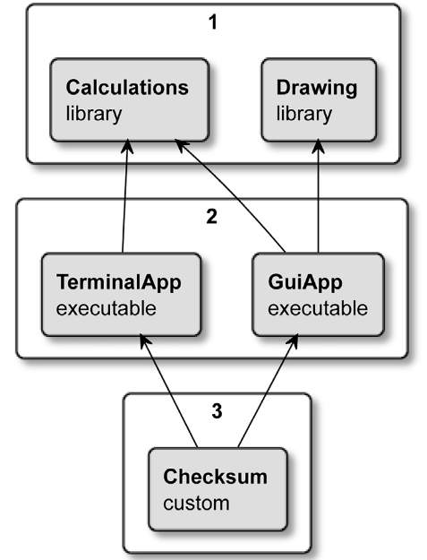

# 一、概述

## 1.2 工作原理

CMake不能独立构建，它依赖于系统中的其他工具来执行实际的编译、链接等任务。它可以看作构建过程的指挥家，它知道需要完成哪些步骤，最终目标是什么，以及如何找到合适的工人和材料。

构建的过程有三个阶段：

1. 配置：读取存储在目录中的项目信息，为生成阶段准备一个输出目录或构建树，包含：
   - 首次运行会创建一个空的构建树，并收集环境相关的信息
   - 如果之前配置过，会从CMakeCache.txt 文件中读取缓存的配置变量
   - 解析CMakeCache.txt 项目配置文件，该文件告诉 CMake 项目的结构、目标、依赖等
   - 在这个过程中CMake 将收集的信息存储在构建树中，例如系统详情、项目配置、日志和临时文件，这些信息会用于下一阶段
2. 生成：根据上一步的配置信息，生成适配当前系统中构建工具的配置文件
3. 构建：运行构建工具，使用编译器、链接器等工具生成目标产品


## 1.4 命令行

CMake是一组工具，包含五个可执行文件：

- cmake：配置、生成和构建项目的核心可执行文件
- ctest：运行和报告测试结果的测试驱动程序
- cpack：生成安装程序和源包的打包程序
- cmake-gui: 窗口化的图形界面
- ccmake: 基于控制台的图形界面


### 1. cmake命令

`cmake`命令主要用来构建项目，构建过程分为两步：

1. 生成构建系统

   构建系统描述了怎么**用构建工具，从源代码生成可执行文件**
   ```bash
   cmake -S <source_dir> -B <build_tree>
   ```
   - 从`source_dir`读取项目文件，在`build_tree`中生成构建系统
   - 两者都省略时，会从当前目录读取项目文件，并在当前目录生成构建系统
   - 如果没有执行过构建，可以只指定项目目录，这时会在运行命令时的目录生成构建系统
     ```bash
     cmake  source_dir
     ```
   生成构建系统时，如果想要删除旧的构建系统，并从头开始生成，有两种方法：
   - 手动删除构建树目录
   - 添加`--fresh`参数
     ```bash
     cmake --fresh -S <source_dir> -B <build_tree>
     ```


   生成构建系统时可以使用`CMAKE_BUILD_TYPE`变量指定构建的类型：
   - 可选值包括`Debug`、`Release`、`MinSizeRel`或`RelWithDebInfo`
     ```bash
     cmake -S . -B ../build -D CMAKE_BUILD_TYPE=Release
     ```
     对于每次只能生成一种构建类型文件的单配置生成器，应该在配置阶段指定构建类型，并为每种配置类型生成一个单独的构建系统

     多配置生成器一般在构建阶段配置构建类型


   在生成构建系统时，可以添加一个`-G generator_name`指定利用什么生成器生成项目，命令`cmake --help`的末尾会列出支持的生成器和默认生成器。
2. 构建项目

   不同生成器生成的项目是不同的，CMake支持了两种方式为生成的项目执行构建：
   1. 使用与构建系统对应的原生构建工具构建项目

      对于Unix Makefile生成器生成的项目，可以使用如下原生命令执行构建
      ```bash
      make
      make install

      ```
   2. 使用如下CMake命令执行构建，它会自动选择与生成项目匹配的构建工具执行构建
      ```bash
      cmake --build build_dir
      ```
      构建时可以指定多种参数实现特定目的：
      - `-j n`：指定作业数量，执行并行构建
        ```bash
        cmake --build build_dir -j 4
        ```
      - `--target t1`或`-t t1`：可以重复使用多次，指定要构建哪些目标
        - 如果指定`-t clean`目标，会将构建的所有产物删除
      - `--clean-first`：构建前先清理目标，再执行指定的构建


### 2. 命令行工具

CMake提供了与平台无关的命令行命令，这些命令可以跨平台执行，可以使用如下方法执行这些命令：

```bash
cmake -E command options
```

- `command`包含`copy`、`echo`、`make_directory`等，可以使用`cmake -E`列出当前平台支持的命令


## 1.5 项目结构

对于CMake项目，除了项目相关的文件外，还需要包含CMake相关的文件。

### 1. `CMakeLists.txt`列表文件

包含CMake语言的文件称为列表文件，文件名没有强制规定，按照惯例通常使用`.cmake`扩展名。

CMake项目通过CMakeLists.txt列表文件进行配置（由于历史原因，没有使用`.cmake`扩展名），该文件应该存放在每个**项目源代码树的顶层**，且**在配置阶段执行**。

顶层的CMakeLists.txt应该至少包含以下两个命令：

- `cmake_minimum_required(VERSION <x.xx>)`：设置期望的CMake版本
- `project(name <OPTIONS>)`：命名项目，设置的名字将在`PROJECT_NAME`变量中保存


可以使用如下方法，在不同的列表文件之间相互包含：

- `include()`
- `find_package()`
- `add_subdirectory()`

  当项目划分为不同的模块时，CMake支持通过子目录及其各自的CMakeLists.txt文件来单独对每一个模块进行配置和管理。


### 2. `CMakeCache.txt`**文件**

CMake生成构建系统时，会在构建目录中生成相关的信息

配置生成阶段会根据列表文件生成各种**缓存变量**（编译器、链接器、工具等的路径），在首次运行的配置阶段，会将这些变量存在CMakeCache.txt文件中。

文件分为两个部分：

- EXTERNAL cache entries：此部分的缓存变量可以由用户修改
- INTERNAL cache entries：此部分的缓存变量由CMake生成并管理


## 1.6 脚本

CMake语言是与平台无关的，且包含很多有用的命令，因此可以利用CMake编写跨平台的脚本语言，实现多个平台共用一个脚本。


CMake独立运行脚本使用命令：

```bash
cmake -P cmake_script.cmake
```

- 可以使用`-D var=value`传递变量
- 可以使用`-- param ...`传递额外参数


CMake脚本的要求：

- 建议在CMake脚本的开头都调用`cmake_minimum_required()`，以告诉CMake对后续的命令应用哪些策略
- 运行CMake脚本不会执行配置、生成、构建阶段，所以用于构建项目的相关命令不能使用


# 二、CMake语言

## 2.2 语法基础

### 1. 注释

两种注释：

1. 单行注释，使用`#`
2. 多行注释：
   - 多行注释的开始：以`#[`开始，0个或多个`=`，`[`结尾的组合
   - 多行注释的结束：以`#]`开始，相同数目的`=`，`]`结尾的组合
   - 可以在多行注释的初始行前再加一个`#`以禁用多行注释
     ```cmake
     ##[=[ this is a single-line comment now
     no longer commented
       #[[
         still, a nested comment  5 
       #]]
     #]=] this is a single-line comment now
     ```
   - 多行注释可以嵌套


多行注释的起始标记中间可以包含若干个`=`，是为了保证即使注释中包含`]]`，也可以选择其他标记作为多行注释的开始

### 2. 命令

命令形式：

```cmake
command_name(args...)
```

- CMake的命令不区分大小写，通常使用下划线连接的小写单词
- CMake的命令调用不是表达式，所以不能将一个命令作为另一个命令的参数
- 命令后不需要加分号


### 3. 命令的参数

CMake在底层只识别字符串，根据传给命令的参数形式，CMake定义了三种类型的参数

1. **括号参数**

   用于**将多行字符串原封不动地作为单个参数**传递给命令，不管字符串内是否有任何注释或表达式

   括号参数的开始：`[`开始，中间0个或多个`=`，`[`结尾的组合

   括号参数的结束：`]`开始，相同个数的`=`，`]`结尾的组合
   ```cmake
   message([[multiline
   bracket
   argument
   ]])

   message([==[
     because we used two equal-signs "=="
     this command receives only a single argument
     even if it includes two square brackets in a row
     { "petsArray" =#[["mouse","cat"],["dog"]] }
   ]==])

   # 输出为
   multiline
   bracket
   argument

     because we used two equal-signs "=="
     this command receives only a single argument
     even if it includes two square brackets in a row
     { "petsArray" = #[["mouse","cat"],["dog"]] }

   ```
   - 当字符串中包含`]]`等字符串时，可以选择其他标记多行注释的开始
2. 引号参数

   类似于字符串，可以在其中包含**转义字符**、**跨越多行**、使用`${var}`**展开变量的引用**
   ```cmake
   message("multi...;
   line ${CMAKE_VERSION}")

   # 输出
   multi...;
   line 3.30.5

   ```
3. 非引号参数

   非引号参数会计算转义字符、变量引用；其中的**分号会被作为列表界定符**，将字符串分割为多个参数
   ```cmake
   message(a\ single\ argument)
   message(two arguments)
   message(three;separated;arguments)

   # 输出
   a single argument
   twoarguments
   threeseparatedarguments

   ```
   - `message`会将多个参数无分隔符的一起输出


### 4. message命令

`message()`用于将文本输出到标准输出，形式为：

```cmake
message([MODE] ”text to print”)
```

- `MODE`可以指定该输出的类型，默认为`STATUS`
- 如果指定类型为`FATAL_ERROR`，会终止脚本的执行，`cmake`命令会返回非0值
- 执行cmake命令生成构建系统时可以指定`--log-level=xxx`参数，从而实现对特定类型`message`输出的过滤


可以利用`CMAKE_MESSAGE_CONTEXT`使得调用`message`输出时包含消息的上下文信息：

- 通过给`CMAKE_MESSAGE_CONTEXT`变量的数组中追加字符串，使得message输出时包含上下文信息
  ```cmake
  function(foo)
    list(APPEND CMAKE_MESSAGE_CONTEXT "foo")
    message(TRACE "foo TRACE message")
  endfunction()

  list(APPEND CMAKE_MESSAGE_CONTEXT "top")

  message(VERBOSE "Before `foo`")
  foo()
  message(VERBOSE "After `foo`")

  # 输出
  [top] Before `foo`
  [top.foo] foo TRACE message
  [top] After `foo`

  ```


## 2.3 变量

### 1. 创建和删除变量

创建或修改变量：`set(var_name var_val)`

- 变量名区分大小写
- 所有变量在内部存储为字符串

```cmake
set(MyString1 "Text1")
set([[My String2]] "Text2")
set("My String 3" "Text3")
message(${MyString1})
message(${My\ String2})
message(${My\ String\ 3})

# 输出
Text1
Text2
Text3

```


删除变量：`unset(var_name)`


### 2. 变量引用

可以使用变量引用`${}`，来获取变量保存的值：

```cmake
message(${MyString1})
```


### 3. 环境变量

CMake会复制执行`cmake`命令时的环境变量，可以使用`$ENV{env_var_name}`获取这些环境变量的值

- `$ENV{}`只会查找当前脚本执行时的环境变量，会忽略上下文中的同名变量


### 4. 缓存变量

`CMakeCache.txt`文件中的缓存变量在**项目列表文件**中可以直接使用。

当使用变量引用时，如果找不到自定义的变量，会继续查找是否存在同名的缓存变量，进而确定是否将变量值计算为空字符串。

- 可以使用`$CACHE{name}`显式指定只查找缓存变量的值
- **CMake脚本**运行时由于不会执行生成构建的过程，所以不存在缓存变量


指定缓存变量：

- 执行`cmake`命令时使用`-C initial_cache_script`指定一个包含一系列`set(xxx CACHE xxx)`命令的脚本，指定用于初始化空构建树的缓存变量
- 执行`cmake`生成构建系统时使用`-D var=value`初始化或修改缓存变量的值
- 使用特殊的`set()`命令：
  ```cmake
  set(var_name value CACHE type desc_string)
  ```


### 5. 作用域

作用域的创建：

1. `bolck()`定义的块
2. `function()`定义的函数
3. `add_subdirectory()`执行另外一个文件时会有新的作用域


- 条件块、循环块、宏不会创建独立的作用域


作用域的规则：

- 创建嵌套作用域时，外层作用域的变量副本被传递给内层作用域，嵌套作用域执行完成后，外层作用域的原始变量被恢复
- `block()`块作用域中set变量时可以传播到外层作用域
  - 如果给block()添加`PROPAGATE`选项，对变量的修改会传播到外层作用域
  - 如果set添加了`PARENT_SCOPE`选项，会将该变量视作外层作用域的变量，修改会传播到外层作用域


### 6. 列表

对于空格分割的无引号参数，CMake会将其视为列表，实际保存时，利用分号分割的字符串表示：

```cmake
set(srcs a.c b.c c.c) # sets "srcs" to "a.c;b.c;c.c"
```

- 如果想要在字符串中使用`;`，应该使用转义字符


CMake提供了一个[list()](https://cmake.org/cmake/help/latest/command/list.html "list()")[命令](https://cmake.org/cmake/help/latest/command/list.html "命令")，用于读取、搜索、修改和排序列表。


## 2.5 控制结构

### 1. 控制语句

条件控制结构：

```cmake
if(<condition>)
  <commands>
elseif(<condition>) # optional block, can be repeated
  <commands>
else()              # optional block
  <commands>
endif()
```


while循环：

```cmake
while(<condition>)
  <commands>
endwhile()
```


foreach循环

```cmake
foreach(<loop_var> <items>)
  <commands>
endforeach()
```

- 循环处理列表中的元素


### 2. 条件判断语句

if和while都会用到[判断语句](https://cmake.org/cmake/help/latest/command/if.html#condition-syntax "判断语句")，判断方法如下

如果判断语句[只有一个变量](https://cmake.org/cmake/help/latest/command/if.html#basic-expressions "只有一个变量")，判断过程为：

1. 由于历史原因，**变量引用**或**无引号字符串**都会执行求值
2. 根据求值的结果执行判断
   - 如果求值结果是无引号字符串，会继续执行求值
   - 如果求值结果是**有引号字符串**或**常量**，根据如下值确定真假
     - True： `1`, `ON`, `YES`, `TRUE`, `Y`, 非0数字
     - False：`0`, `OFF`, `NO`, `FALSE`, `N`, `IGNORE`, `NOTFOUND`, 空字符串, 以`-NOTFOUND`结尾的字符


条件判断支持各种运算，如：

逻辑运算：支持`NOT`、`AND`、`OR`

比较运算：

- EQUAL：比较数字
- STREQUAL：对字符串根据字典序比较
- LESS，LESS\_EQUAL
- GREATER，GREATER\_EQUAL

检查文件系统：

- EXISTS path-to-file-or-directory


### 3. 宏和函数

宏用于表示需要替换的指令合集

```cmake
macro(<name> [<arg1> ...])
  <commands>
endmacro()
```


函数用于表示可执行单元：

```cmake
function(<name> [<arg1> ...])
  <commands>
endfunction()
```


# 四、第一个CMake项目

## 4.1 指定最低CMake版本

项目文件和脚本的顶部使用`cmake_minimum_required(VERSION n.x.x)` 命令，会隐式执行[cmake\_policy(VERSION)](https://cmake.org/cmake/help/latest/command/cmake_policy.html#version "cmake_policy(VERSION)")，指定项目配置时要使用的策略。


## 4.2 定义语言和元数据

应该在`cmake_minimum_required`后立即执行`project`指令，指明项目相关的信息：

```cmake
project(<PROJECT-NAME> [<language-name>...])
project(<PROJECT-NAME>
        [VERSION <major>[.<minor>[.<patch>[.<tweak>]]]]
        [DESCRIPTION <project-description-string>]
        [HOMEPAGE_URL <url-string>]
        [LANGUAGES <language-name>...])
```

该命令会隐式创建一系列相关的变量，以保存**项目与设置的相关值**。如：

- [PROJECT\_SOURCE\_DIR](https://cmake.org/cmake/help/latest/variable/PROJECT_SOURCE_DIR.html#variable:PROJECT_SOURCE_DIR "PROJECT_SOURCE_DIR"), [\<PROJECT-NAME>\_SOURCE\_DIR](https://cmake.org/cmake/help/latest/variable/PROJECT-NAME_SOURCE_DIR.html#variable:<PROJECT-NAME>_SOURCE_DIR "<PROJECT-NAME>_SOURCE_DIR")：保存源代码的绝对路径
- [PROJECT\_BINARY\_DIR](https://cmake.org/cmake/help/latest/variable/PROJECT_BINARY_DIR.html#variable:PROJECT_BINARY_DIR "PROJECT_BINARY_DIR"), [\<PROJECT-NAME>\_BINARY\_DIR](https://cmake.org/cmake/help/latest/variable/PROJECT-NAME_BINARY_DIR.html#variable:<PROJECT-NAME>_BINARY_DIR "<PROJECT-NAME>_BINARY_DIR")：保存构建目录的绝对路径
- [PROJECT\_IS\_TOP\_LEVEL](https://cmake.org/cmake/help/latest/variable/PROJECT_IS_TOP_LEVEL.html#variable:PROJECT_IS_TOP_LEVEL "PROJECT_IS_TOP_LEVEL"), [\<PROJECT-NAME>\_IS\_TOP\_LEVEL](https://cmake.org/cmake/help/latest/variable/PROJECT-NAME_IS_TOP_LEVEL.html#variable:<PROJECT-NAME>_IS_TOP_LEVEL "<PROJECT-NAME>_IS_TOP_LEVEL")：保存调用`project()`命令的作用域是否在顶层`CMakeLists.txt`中


## 4.3 划分项目

当项目过大时，可以将整个项目分为多个小模块，此时可以为每个模块中单独编写CMake脚本。


在一个CMakeLists.txt中可以引入其他CMake脚本，分为两种：

- `include()`执行外部文件中的代码
- `add_subdirectory()`添加一个源目录到构建中


### 1. include() 引入模块

CMake项目可以使用外部的CMake模块来增强其功能，CMake本身也包含了多个实用模块

可以通过`include()`包含其他模块

```cmake
include(<file_name|module_name>)
```

- 如果给定的是一个文件名（包含`.cmake`后缀的文件名），会打开并运行该脚本

  等价于将CMake代码引入当前作用域执行，文件中定义的变量等信息在文件执行完后，在当前作用域可见
- 如果给定的是一个模块名（无`.cmake`后缀的名称），会按照特定的顺序查找一个模块，并将模块内容引入当前目录。
  - 先在`CMAKE_MODULE_PATH`所指定的路径中查找`module_name.cmake`的文件
  - 没找到时到CMake自身的模块目录中查找模块名


### 2. add\_subdirectory()

```cmake
add_subdirectory(source_dir [binary_dir] [EXCLUDE_FROM_ALL])
```

- 添加一个包含`CMakeLists.txt`的源目录`source_dir`，并执行构建该子目录
- 可以指定该子目录构建文件的保存路径`binary_dir`；如果没有指定保存路径，会在`cmake -B build_dir`指定的构建目录中生成`source_dir`同名的子文件夹，保存该子目录的构建信息
- 该方法会创建新的作用域执行CMake脚本，且可以对该脚本独立配置，因此新作用域中的变量不会传递到外层作用域；但是**`add_subdirectory`****子目录中所执行****`CMakeLists.txt`****文件中生成的目标等工件是全局可用的**


## 4.4 项目结构

CMake推荐的项目结构如下：


其中每个可执行文件按照如下方法组织：


库的结构应该为：


## 4.5 环境信息

CMake构建的项目所运行的系统称为**目标系统**

目标系统的名字和版本号保存在：

- [CMAKE\_SYSTEM\_NAME](https://cmake.org/cmake/help/latest/variable/CMAKE_SYSTEM_NAME.html "CMAKE_SYSTEM_NAME")：保存构建目标适配的操作系统名字
- [CMAKE\_SYSTEM\_VERSION](https://cmake.org/cmake/help/latest/variable/CMAKE_SYSTEM_VERSION.html "CMAKE_SYSTEM_VERSION")：保存构建目标适配的操作系统版本

可以通过修改这两个变量，实现交叉编译（在一个机器平台上编译代码，以在另一个目标平台运行）

目标系统的相关信息还包括：

- [CMAKE\_SIZEOF\_VOID\_P](https://cmake.org/cmake/help/latest/variable/CMAKE_SIZEOF_VOID_P.html "CMAKE_SIZEOF_VOID_P")：保存空指针的大小是32位还是64位，可以用来判断目标系统的架构位数
- [CMAKE\_\<LANG>\_BYTE\_ORDER](https://cmake.org/cmake/help/latest/variable/CMAKE_LANG_BYTE_ORDER.html "CMAKE_<LANG>_BYTE_ORDER")：目标系统的字节序是什么


**主机信息**是指当前运行CMake命令机器的相关信息，这些信息保存在`XXX_HOST_XXX`类似的变量中，如：

- CMAKE\_HOST\_SYSTEM
- CMAKE\_HOST\_SYSTEM\_NAME
- CMAKE\_HOST\_SYSTEM\_PROCESSOR
- CMAKE\_HOST\_SYSTEM\_VERSION


部分更加详细的主机信息CMake没有直接保存到变量中，可以通过命令查询：

```cmake
cmake_host_system_information()
```


## 4.6 工具链配置

设置C++标准分为两种：

1. 为整个项目设置版本：
   ```cmake
   set(CMAKE_CXX_STANDARD 23)
   ```
2. 即使为整个项目设置了版本，还可以为每个目标单独指定版本
   ```cmake
   # 为单个目标设置 C++ 版本
   set_property(TARGET <target> PROPERTY CXX_STANDARD <version>)

   # 为多个目标设置 C++ 版本
   set_target_properties(<targets> PROPERTIES CXX_STANDARD <version>)

   ```


当为项目或目标设置了C++版本，但是编译器不支持所需的版本时，CMake也会继续构建，如果想要强行指定必须满足指定的C++版本，可以使用如下命令：

```cmake
set(CMAKE_CXX_STANDARD_REQUIRED ON)
```

- 此时如果编译器不支持需要的标准，会输出提示信息并停止构建


部分生成器使用的编译器可能包含编译器厂商自己扩展的相关语言特性，CMake默认也是允许使用厂商的扩展特性的。为了提高程序的可移植性，可以通过如下方法禁止使用扩展特性：

```cmake
set(CMAKE_CXX_EXTENSIONS OFF)
```


部分项目可能想要禁止内部构建，这时可以通过如下方法，指定当执行内部构建时输出提示信息并退出构建：

```cmake
if(PROJECT_SOURCE_DIR STREQUAL PROJECT_BINARY_DIR)
  message(FATAL_ERROR "In-source builds are not allowed")
endif()
```


# 五、目标

CMake目标表示一个特定的逻辑单元，一个目标可以依赖于其他目标，CMake负责确定构建目标的顺序与优化构建。

## 5.1 生成目标

CMake有三个命令可以生成目标：

- `add_executable()`：生成可执行文件目标
- `add_library()`：生成库文件目标
- `add_custom_target()`：生成自定义目标


特点：

- 生成可执行文件或库文件前，会检查源代码是否有更新，**源代码发生变化时才会重新构建**，以减少不必要的编译。生成自定义目标时不会执行该检查，因此一定会执行编译过程重新构建。
- 以上三个命令生成的目标称为**顶层目标**


### 1. 生成可执行文件

命令：

```cmake
add_executable(target_name 
               [EXCLUDDE_FROM_ALL]
               [source1] [source2 ...])
```

- 需要指定目标名称和源文件列表
- CMake执行构建时默认会构建所有顶层目标，`EXCLUDDE_FROM_ALL`关键字指定默认不构建该目标，只有通过`cmake --build -t target_name`指定目标时才构建


### 2. 生成库文件目标

命令：

```cmake
add_library(name [STATIC | SHARED | MODULE]
            [EXCLUDE_FROM_ALL]
            [source1] [source2 ...])
```

- 需要指定目标名称和源文件列表
- `EXCLUDDE_FROM_ALL`的作用与生成可执行文件时相同
- 通过指定STATIC、SHARED  和 MODULE 关键字中的一个确定库的类型

  部分平台上，当指定生成`SHARED`共享库时，可以使用`set_property(TARGET mySharedLib PROPERTY SOVERSION 1)`指定库的版本号（会生成的库文件`libMySharedLib.so.1`，和指向它的符号连接`libMySharedLib.so`）


### 3. 生成自定义目标

自定义目标添加**没有输出文件**的目标。通常用于执行一些不需要生成文件的任务，如：

- 运行测试、清理工作区等
- 计算二进制文件的校验和
- 运行sanitizer执行代码扫描并收集结果


命令：

```cmake
add_custom_target(target_name
                  [ALL]
                  [COMMAND command1 [args...]...])
```

- 添加一个自定义的目标，当指定构建该目标时，等价于按顺序执行`COMMAND`指定的所有命令
- 默认情况下，自定义目标不会构建，可以通过为自定义目标指定`ALL`参数，使得默认构建该目标；也可以使用`cmake --build <build_tree> -t target_name`指定构建并运行自定义目标`target_name`


## 5.2 依赖关系

对于一个目标来说，它可能依赖于一个或多个其他目标。



对于图中的构建，`GuiApp`依赖于`Calculations`和`Drawing`库文件，`TerminalApp`依赖于`Calculations`库文件。`Chesksum`自定义目标依赖于`GuiApp`和`TerminalApp`可执行文件。


为可执行文件添加库文件依赖使用命令：

```cmake
target_link_libraries(target_name [lib_target ...])
```

- 如果给一个可执行文件指定了所依赖的库文件，则可执行文件和库文件构成隐式依赖关系，CMake会先构建库文件


对于自定义目标文件使用的命令`add_custom_target`，CMake无法获取其依赖（即使其中使用了某些目标），因此自定义目标的构建顺序可能会先于其使用的目标。

可以使用如下命令显式指定一个顶层目标依赖另外一个顶层目标，实现指定自定义目标与所依赖目标的依赖关系：

```cmake
add_dependencies(target [target_dependency]...)
```


在执行cmake命令生成配置项目时，可以添加如下参数，生成`dot/graphviz`格式的目标关系依赖图：

```bash
cmake --graphviz=file_name.dot -S source_dir -B build_dir
```

- 自定义目标默认不会出现在生成的依赖图中，可以创建一个内容是`set(GRAPHVIZ_CUSTOM_TARGETS TRUE)`命令的`CMakeGraphVizOptions.cmake`文件以在依赖图文件中包含自定义目标
- 将生成的文件内容使用支持Graphviz格式的[网站](https://dreampuf.github.io/GraphvizOnline/ "网站")或软件中，即可查看可视化的依赖图


## 5.3 目标的属性

每个目标都有若干[属性](https://cmake.org/cmake/help/latest/manual/cmake-properties.7.html#properties-on-targets "属性")，用于描述该目标的相关信息

**在执行生成目标时指定的各种参数信息，可能都会在某个目标属性中保存**

可以使用如下命令获取和设置目标的属性：

- **获取**目标的指定属性
  ```cmake
  # 将 target 的 property_name 属性保存到 variable 变量中
  get_target_property(variable target_name property_name)
  ```
- **设置**目标的指定属性
  ```cmake
  set_target_properties(targets ...
                        PROPERTIES prop1 value1
                        [prop2 value2] ...)

  ```
  - 可以指定多个目标，且同时设置多个属性


由于一个目标可能使用另外一个目标，因此，目标的属性可能会传递到其他目标。

对于一部分目标属性，在给该属性指定值时就可以说明**能否传递该属性到其他目标**。如，命令：

```cmake
target_compile_definitions(target
                           <INTERFACE|PUBLIC|PRIVATE> [items1...]
                           [<INTERFACE|PUBLIC|PRIVATE> [items2...] ...])
```

- 定义传递给目标的预处理宏，根据指定的不同`INTERFACE | PUBLIC | PRIVATE`选项，会将宏保存到不同属性中
  - 如果指定`PRIVATE`，会在`COMPILE_DEFINITIONS`目标属性中追加定义的预处理宏
  - 如果指定`INTERFACE`，会在`INTERFACE_COMPILE_DEFINITIONS`目标属性中追加定义的预处理宏
  - 如果指定`PUBLIC`，会同时在`COMPILE_DEFINITIONS`和`INTERFACE_COMPILE_DEFINITIONS`中追加定义的宏
- 如果有新目标使用了源目标，CMake在配置阶段根据新目标使用源目标时指定的参数，会将源目标中**类似**`INTERFACE_PRORERTY_NAME`**属性值**追加到**新目标的**`PROPERTY_NAME`**或**`INTERFACE_PRORERTY_NAME`**属性**中，即新目标中会包一个`PROPERTY_NAME`属性


当一个新目标使用一个源目标时，可以指定怎么处理源目标传递来的属性。如，为目标链接库文件的命令有一个重载为：

```cmake
target_link_libraries(target
                      <INTERFACE|PUBLIC|PRIVATE> [items1...]
                      [<INTERFACE|PUBLIC|PRIVATE> [items2...] ...])    

```

- 当指定不同选项时，对源目标传递来的目标属性有不同的处理方式：
  - 如果指定了`PRIVATE`，只会将源目标链接到新目标。

    源目标传递来的目标属性追加到新目标的对应`PROPERTY_NAME`属性后
  - 如果指定了`INTERFACE`，只会将源目标作为新目标接口的一部分，不会链接到该新目标。

    传递来的目标属性追加到对应的`INTERFACE_PROPERTY_NAME`属性后

    按照上一条对`INTERFACE_XXXXX`属性的处理过程，新目标如果再被其他新目标使用，其他新目标可能会包含一个`XXXXX`属性
  - 如果指定了`PUBLIC`，会将源目标链接到新目标，还会将源目标作为新目标接口的一部分。

    传递来的目标属性同时追加到`PROPERTY_NAME`和`INTERFACE_PROPERTY_NAME`属性后
- 由于`INTERFACE_XXXXX`形式的目标属性可以传递到其他目标，所以可以构成目标属性的传播链
- 根据CMake[官方文档描述](https://cmake.org/cmake/help/latest/manual/cmake-buildsystem.7.html#target-usage-requirements "官方文档描述")，使用`PRIVATE`传递的依赖可以被源文件使用、使用`INTERFACE`传递的依赖只能被头文件使用（头文件就是接口，会继续传递给其他目标）、使用`PUBLIC`传递的依赖可以同时被头文件和源文件使用
- 没有`INTERFACE | PUBLIC | PRIVATE`参数的`target_link_libraries`默认按照`PUBLIC`传递依赖


## 5.3 伪目标

一些不作为生成系统最终输出结果的目标称为伪目标，它们也能利用目标的相关特殊性传递信息。


### 1. 别名目标

可以为可执行文件和库文件目标创建另一个不同的名称引用，使用的命令与创建可执行文件和库文件类似：

```cmake
add_executable(new_name ALIAS target)
add_library(new_name ALIAS target)

```

- 别名的属性只能读，不能使用别名修改所引用目标的属性值


### 2. 接口库

有两种方式添加接口库：

```cmake
add_library(name INTERFACE)
```

- 创建一个逻辑的库目标，一般会为其添加一些`INTERFACE_*`属性，并将这个目标作为其他目标的依赖，以实现纯粹的向其他目标传递属性


```cmake
add_library(name INTERFACE [EXCLUDE_FROM_ALL] sources...)
```

- 常用于创建一个仅包含头文件的库，给其他目标来链接


### 3. 导入库

```cmake
add_library(name)
            <SHARED|STATIC|MODULE|OBJECT|UNKNOWN>
            IMPORTED [GLOBAL])
```

- 导入外部的库，CMake不会为这类库执行编译


参考链接：[cmake : add\_library详解](https://blog.csdn.net/LaineGates/article/details/108242803 "cmake : add_library详解")

## 5.4 目标库

[目标库](https://cmake.org/cmake/help/latest/manual/cmake-buildsystem.7.html#object-libraries "目标库")就是将多个`.cpp`源文件编译得到**目标文件**后，组成一个**集合**

命令：

```cmake
add_library(<objlib> OBJECT <sources>...)
```

- 将多个源文件的目标文件组合为单一的逻辑目标（类似于将执行`g++ -c`生成的文件打包为一个），一般用于作为其他目标的编译元素
- 可以使用生成器表达式`$<TARGET_OBJECTS:objlib>`在执行其他`add_library()`和`add_executable()`命令时引用目标库`objlib`。如：
  ```cmake
  add_library(... $<TARGET_OBJECTS:objlib> ...)
  add_executable(... $<TARGET_OBJECTS:objlib> ...) 
  # 若 add_library(objlib OBJECT a.cpp b.cpp)，类似于执行 g++ -c a.cpp b.cpp
  # add_executable(exe_tag $<TARGET_OBJECTS:objlib>)，类似于执行 g++ a.o b.o -o exe_tag
  ```
- 也可以使用`target_link_libraries()`给某个target链接目标文件库
  ```cmake
  target_link_libraries(<target> objlib)
  ```


## 5.5 自定义命令

用于为生成的目标文件添加自定义构建规则。它通常用于在构建过程中生成源代码、头文件或其他文件。

包含两个重载：

```cmake
add_custom_command(OUTPUT output1 [output2 ...]
                   COMMAND command1 [ARGS] [args1...]
                   [COMMAND command2 [ARGS] [args2...] ...])
```

- 执行指定的command命令，生成output1...等文件
- 其他参数见——[Generating Files](https://cmake.org/cmake/help/latest/command/add_custom_command.html#generating-files "Generating Files")


```cmake
add_custom_command(TARGET <target>
                   PRE_BUILD | PRE_LINK | POST_BUILD
                   COMMAND command1 [ARGS] [args1...]
                   [COMMAND command2 [ARGS] [args2...] ...]
```

- 不同参数表示在**目标构建前**、**目标链接阶段**、**目标构建后**，执行特定的command命令
- 其他参数见——[Build Events](https://cmake.org/cmake/help/latest/command/add_custom_command.html#build-events "Build Events")


# 六、生成器表达式

生成器表达式将在生成阶段进行计算，主要用于从目标的生成配置、构建环境中收集信息。

生成器表达式通常**用在支持生成表达式计算的CMake命令中**，生成器表达式作为占位符，在生成阶段得到值，命令的结果在生成阶段才能得到。


### 6.1 生成器表达式语法

生成器表达通常具有如下形式：

```cmake
$<EXPRESSION[:arg1,arg2...]>
```

- 生成器表达式在`$<>`中间
- `EXPRESSION`表示要执行的操作
- 可以使用`:arg1,arg2...`给操作传入需要的参数


生成器表达式在生成阶段，根据参数运行`EXPRESSION`操作，最终得到的结果有两种：

1. 布尔值
2. 字符串


可以在生成器表达式中嵌套：

- 生成器表达式，如将一个生成器表达式作为另一个生成器表达式的参数`$<EXP1:$<EXP2>>`
- 变量，此时会在配置阶段将变量值展开，生成器表达式的值会在生成阶段展开（应该避免使用这种形式）


## 6.2 生成器表达式中支持的操作

### 1. 条件操作

语法：

```cmake
$<IF:condition,true_string,false_string>
```

- `IF`表示该生成器表达式是一个条件操作
- 根据**生成器表达式****`condition`****返回的布尔值**，确定返回`true_string`还是`false_string`


条件操作可以简化为：

1. 在条件为真时返回`true_string`，在条件为假时返回空字符串
   ```cmake
   $<IF:condition,true_string,>
   ```
2. 以上还可以简写为（不建议这样使用）：
   ```cmake
   $<condition:true_string>
   ```


### 2. 返回布尔值的操作

条件操作的第一个参数应该是返回布尔值的生成器表达式，有三类表达式返回布尔值：

1. 逻辑运算符
   - `$<NOT:arg>`：对返回布尔值的生成器表达式`arg`的结果取反
   - `$<AND:arg1,arg2,...>`：所有的生成器表达式`argx`都是真时返回真
   - `$<OR:arg1,arg2,arg3...>`：只要`arg`中任意个为真，返回真
   - `$<BOOL:string_arg>`：将字符串参数转换为布尔类型（[转换规则](https://cmake.org/cmake/help/latest/manual/cmake-generator-expressions.7.html#genex:BOOL "转换规则")）
2. 比较
   - `$<STREQUAL:arg1,arg2>`：以区分大小写的方式比较字符串是否相同
   - `$<EQUAL:arg1,arg2>`：将字符串转换为数字比较大小
   - `$<IN_LIST:arg,list>`：检查arg是否在list列表中
   - 等
3. 查询类

   这类表达式有多个，通过查询指定的参数是否存在，返回真或假

   如：`$<TARGET_EXISTS:arg>`：返回arg表示的目标是否存在


### 3. 获取配置和平台信息的操作

- `$<CONFIG>`：返回[配置名](https://cmake.org/cmake/help/latest/manual/cmake-generator-expressions.7.html#configuration-expressions "配置名")
- `$<PLATFORM_ID>`：返回当前平台的[类型名](https://cmake.org/cmake/help/latest/manual/cmake-generator-expressions.7.html#platform "类型名")


### 4. 其他的生成器表达式操作

- `$<LOWER_CASE:string>`，`$<UPPER_CASE:string>`：将[字符串](https://cmake.org/cmake/help/latest/manual/cmake-generator-expressions.7.html#string-transformations "字符串")转换为小写或大写
- `$<LIST:...>`：对[**列表**](https://cmake.org/cmake/help/latest/manual/cmake-generator-expressions.7.html#list-expressions "列表")进行相关的操作
- `$<PATH:...>`：对[**路径**](https://cmake.org/cmake/help/latest/manual/cmake-generator-expressions.7.html#path-expressions "路径")进行相关的操作
- 工具链和语言相关的[操作](https://cmake.org/cmake/help/latest/manual/cmake-generator-expressions.7.html#toolchain-and-language-expressions "操作")
- 获取目标的相关信息的[操作](https://cmake.org/cmake/help/latest/manual/cmake-generator-expressions.7.html#target-dependent-expressions "操作")


## 6.3 生成器表达式的调试

生成器表达式的结果在配置完成后才进行计算，所以不能使用配置时的命令，如`message`。

可以使用如下方法进行[验证调试](https://cmake.org/cmake/help/latest/manual/cmake-generator-expressions.7.html#debugging "验证调试")：

- 将结果写入文件（使用`file(GENERATE)`命令）
- 添加一个自定义目标输出指定的生成器表达式值，当项目构建完成后，显式构建该自定义目标以获取生成器表达式的值


# 七、对单C++源文件的处理

## 7.1 编译基础

编译就是**将高级语言编写的程序转换为机器代码**的过程，即根据给定平台的二进制目标文件的格式，生成给定处理器可以直接执行的机器代码。

不同系统的目标文件格式是不同的，如：

- Linux的目标文件格式为可执行和可链接格式（Executable and Linkable Format, ELF）
- Windows使用PE/COF格式规范
- MacOS使用Mach-O格式的Mach对象


C++程序到可执行文件的过程为：

1. 将每个**单独的cpp实现文件**（翻译单元）编译成**目标文件**（object file），该过程包括：

   （每个文件单独编译是模块化思想，这使得修改某个文件时，只需要单独重新编译该文件，而不用将整个程序重新编译）
   - 预处理：充当高级的查找和替换工具，对代码的`#include`、`#define`、`#ifdef`等进行处理
   - 语法语义分析：检查程序是否有语法错误
   - 汇编：一些编译器会先将上面两步处理后的代码先编译为汇编代码，再交由汇编程序生成CPU可以执行的机器代码。一些编译器默认直接生成机器代码，但是可以指定同时生成汇编代码。
   - 优化：优化可能在上面的每一步中执行。如函数的内联展开等。
   - 代码生成：将优化后的机器代码按照目标平台的规范，写入目标文件
   - GCC编译器中可以使用`g++ -c`命令生成目标文件
     ```bash
     g++ -c a.cpp b.cpp
     # 以上命令会生成 a.o 和 b.o 两个目标文件

     ```
2. 将**所有目标文件链接**成单一的可执行文件
   - 使用链接器，适当地重定位目标文件位置，并解析对外部名字的引用
   - 将ASCII源码转变为可以由CPU直接处理的**二进制可执行文件**
   - GCC编译器使用`g++`命令将目标文件链接为可执行文件
     ```bash
     g++ a.o b.o
     # 以上命令会生成 a.out 可执行文件

     ```


如第五章所述，CMake可以使用`add_library(obj_lib OBJECT)`创建目标文件库，且目标文件可以被可执行目标和其他库目标使用


CMake执行编译时，可以使用如下命令，为每个目标指定构建时所需要的编译器特性：

```cmake
target_compile_features(target
                        <PRIVATE|PUBLIC|INTERFACE>
                        feature...)
```

- 如`target_compile_features(my_target PUBLIC cxx_std_26)`指定需要给定的目标使用了C++26的特性


## 7.2 管理源文件

对C++项目执行编译的第一步是指定所有的源文件，生成**逻辑目标**，方法包括：

- `add_executable()`，指定源文件列表，生成可执行文件目标
- `add_library()`，指定源文件列表，生成库文件目标
- [target\_sources](https://cmake.org/cmake/help/latest/command/target_sources.html "target_sources")`(target <INTERFACE|PUBLIC|PRIVATE> [items1...])`

  用于**为目标添加额外的源文件**；还会根据规则，将源文件列表追加到`SOURCES`或`INTERFACE_SOURCES`属性
  ```cmake
  add_executable(main main.cpp)
  # main 可执行文件会根据不同平台，额外添加不同的源文件（编译时会使用所有指定过的文件）
  if(CMAKE_SYSTEM_NAME STREQUAL "Linux")
    target_sources(main PRIVATE gui_linux.cpp)
  else()
    target_sources(main PRIVATE gui.cpp)
  endif()
  ```


## 7.3 配置预处理器

源文件中，以`#`开头的都是预处理语句，它们都会在预处理阶段被处理

因此还需要配置对**逻辑目标**中预处理语句的处理方法


### 1. 头文件搜索路径

`#include`是一种基础的预处理语句，在预处理阶段，会**将头文件中的内容替换这些语句**

它有两种形式：

- `#include <path_spec>`：优先到标准库目录中查找头文件
- `#include "path_spec"`：优先在当前文件所在的目录中查找头文件，未找到时会到标准库目录中查找


有两种方法为目标指定头文件：

1. 使用如下[命令](https://cmake.org/cmake/help/latest/command/target_include_directories.html "命令")，指定目标可以取哪些文件夹搜索需要的头文件（类似于编译时提供给`-I`）：
   ```cmake
   target_include_directories(target 
                              <INTERFACE|PUBLIC|PRIVATE>
                              [items1...])

   ```
   - 会根据传入的标志位，将路径保存到目标属性`INCLUDE_DIRECTORIES`或`INTERFACE_INCLUDE_DIRECTORIES`
2. 使用`target_sources`的`FILE_SET`功能
   ```cmake
   target_sources(<target>
     [<INTERFACE|PUBLIC|PRIVATE>  # 指定文件集的范围
      [FILE_SET <set> [TYPE <type>] [BASE_DIRS <dirs>...] [FILES <files>...]]...
     ]...)
   ```
   - 使用`FILE_SET`选项为目标添加多个文件构成的集合，一个目标可以添加多个文件集
   - 每个文件集需要指定文件集的名字（`<set>`）、文件集中的文件类型（`TYPE`）、基目录（`BASE_DIRS`）、包含的文件列表（`FILES`）
   - 当指定文件集的类型 `TYPE HEADERS`时，表示是为目标添加头文件构成的集合，此时会将基目录中所有的文件路径追加到`INCLUDE_DIRECTORIES`或`INTERFACE_INCLUDE_DIRECTORIES`
   - 文件列表中指定的所有文件都应该是**基目录或其子目录**中的文件
   - 可以将文件集的名字设置为某一文件类型，这样就可以省略`TYPE`选项
   ```cmake
   target_sources(calc PUBLIC
                  FILE_SET HEADERS
                  BASE_DIRS include
                  FILES include/calc/basic.h)
   # 为 calc 目标添加 include 中的头文件

   ```


### 2. 定义预处理器

使用如下[指令](https://cmake.org/cmake/help/latest/command/target_compile_definitions.html "指令")，在目标编译时传递预处理器（等价于`g++`编译时指定的`-D`）：

```cmake
target_compile_definitions(target
                           <INTERFACE|PUBLIC|PRIVATE> [items1...])
```

- CMake会忽略`item`中的前导`-D`


示例：

```cmake
set(VAR 8)
# 等价于传递了两个预处理常量 ABC=1 和 DEF=8
target_compile_definitions(defined PRIVATE ABC "DEF=${VAR}")


```


还可以使用处理文件的[configure\_file](https://cmake.org/cmake/help/latest/command/configure_file.html "configure_file")指令，生成包含预处理器定义的头文件，实现对预处理器的批量导入。此时使用`configure_file`指令的如下形式：

```cmake
configure_file(input output)
```

- 该指令会对`input`文件进行一些指定的处理，生成`output`文件
- 文件处理过程中会有如下规则：
  1. 如果`input`文件中利用`@VAR@`, `${VAR}`, `$CACHE{VAR}`和`$ENV{VAR}`形式使用了执行`configure_file`命令时上下文的`VAR`变量，生成`output`时会利用变量的值替换`input`文件中的这些内容
  2. 如果`input`文件中某行是`#cmakedefine MACRO ...`形式，在`output`中会被替换为`#define MACRO ...`


利用以上规则，可以通过如下方法导入CMake中批量定义的预处理器：

1. 定义每一行都是`#cmakedefine MACRO ${VAR}`形式的`configure.h.in`文件
2. 利用`configure_file(configure.h.in configure.h)`命令，生成包含对应`#define MACRO VAR_VALUE`预处理器定义的`configure.h`文件
3. 在需要使用这些预处理器的文件中`#include<configure.h>`


## 7.4 配置优化器

优化器运行在代码编译各个阶段，通过多种策略，提高最终生成的机器代码目标文件的运行效率。

每个编译器都有自己的优化策略，但是多数编译器默认情况下不会开启优化，因此需要我们手动开启。

通常使用如下[命令](https://cmake.org/cmake/help/latest/command/target_compile_options.html "命令")指定编译时要执行哪些优化：

```cmake
target_compile_options(target
                       [BEFORE]
                       <INTERFACE|PUBLIC|PRIVATE> [item1...])

```

- 为`target`指定编译时的优化参数，会根据提供的不同选项，将`item`追加到`COMPILE_OPTIONS`  或`INTERFACE_COMPILE_OPTIONS`目标属性后
- 如果指定了`BEFORE`选项，会将`item`添加到目标属性的前面
- 该命令实际对应于执行编译命令时指定的选项参数（如可以为`gcc`添加`-D`选项），但是更推荐使用专用指令执行需要的操作（即使用`target_compile_definition()`指定`-D`），以保证CMake脚本的可移植性。


通常，可以指定如下的优化方式：

1. 通用优化

   大多数编译器提供了0到3的四个优化级别，使用`-On`选项指定，从0\~3分别表示
   - `0`：不优化（默认）
   - `1`：部分优化，执行一定数量的优化机制，不会过分减慢编译速度
   - `2`：完全优化，生成高度优化的代码，编译时间最慢
   - `3`：执行与`2`相同的优化，但是对子程序内联和循环向量化使用更激进的策略


   默认情况下，CMake在不同的构建类型下，为目标指定了默认的优化级别，它们分别保存在全局变量中：
   - `CMAKE_CXX_FLAGS_DEBUG`，值为`-g`，当构建方式为`Debug`时默认使用该优化参数。`-g`会要求以操作系统的原生格式添加调试信息，这些信息可以被`gdb`调试器访问。
   - `CMAKE_CXX_FLAGS_RELEASE`，值为`-O3 -DNDEBUG`，当构建方式为`Release`时默认使用该优化参数。`NDEBUG`预处理器会禁用一些面向调试的宏，如`assert`。
   这些变量会在`target_compile_options`传入的参数前传递给命令，当多次指定`-O`时，最后一个才会生效。因此可以通过修改这些变量或在`target_compile_options()`指定参数（更推荐），实现覆盖默认行为。
2. 是否禁用编译器执行的函数内联优化
3. 是否允许编译器执行循环展开
4. 是否允许编译器执行循环向量化


## 7.5 管理编译过程

### 1. 减少编译时间

减少编译时间主要包含两种方式：

- [预编译头文件](https://cmake.org/cmake/help/latest/command/target_precompile_headers.html "预编译头文件")。即在编译开始前，由预处理器对头文件处理，生成编译器特定的二进制头文件，其中包含所有头文件的名字，CMake会使用编译器特定的命令行选项将这些头文件包含进来（不需要在源文件中引入该头文件）
- 统一构建。利用指令，将多个源文件组合在一起，一块执行构建


### 2. 发现错误

编译时的错误和警告信息的处理方式也可以指定：

- `-Werror`：将所有的警告视为错误，发生警告时直接停止编译
- `-Wall`：打开所有警告
- `-Wextra`：列出没被`-Wall`列出的警告


# 八、链接可执行文件和库

根据以上讨论可知，对单个文件的处理的结果是得到一个二进制目标文件，但是对于一个程序来说，可能会存在多个源文件，所以也会生成多个目标文件。

因此，我们还需要将这些目标文件合并成一个可执行文件，以简化CPU执行的过程。

合并的过程称为**链接**。


## 8.1 链接的过程

单个`.cpp`文件经过编译阶段生成的**目标文件格式**是**ELF格式**的变体（类Unix系统中），编译器会将从代码中收集到的信息按照类型分为不同的节，保存到目标文件的对应位置。


由于每个目标文件中包含的信息可能都不相同，因此将他们链接为可执行文件时需要按照特定的规则执行。包含：

- 重定位：将不同目标中间的相同类型的节组合在一起。这一过程中还需要更新文件内的内部引用等操作。
- 解析引用：当一个目标文件中使用了另一个目标文件中的名字时，编译器需要在生成的可执行文件中，确定该名字的具体地址


经过链接后，会生成ELF格式的可执行文件，其结构相比于目标文件，添加了一个**程序头部**，记录了在程序运行时应该怎么处理各种类型的节。


## 8.2 目标文件链接为库

对于部分源文件，可能主要提供给其他程序使用，这时涉及到对编译输出的共享

可以将多个目标文件合并为一个单元（使用`add_library()`），称为**库**，库可以共享给可执行文件或其他库链接使用（使用命令`target_link_libraries()`）

按照约定，**库名字**通常有一个**`lib`****前缀**，且根据库的使用方法将库分为不同的类型，不同类型的库在不同系统上会有特定的扩展名。库的类型包括三种：

1. 静态库
2. 动态库
3. 共享模块/模块


### 1. 静态库

静态库本质上是将目标文件直接存储在一起（类Unix中使用`ar`命令），且可以通过创建索引（类Unix中使用`ranlib`命令），使得被链接时提高链接速度

当可执行文件或库使用静态库时，会在链接阶段，将**静态库中需要的名字**直接**导入可执行文件或库内部**。这种集成确保了生成的可执行文件或库文件是独立的，运行时不需要依赖外部文件。

CMake中利用`.cpp`源文件**生成静态库**可以使用如下命令：

```cmake
# 默认生成静态库，可以设置 BUILD_SHARED_LIBS=ON 以默认生成动态库
add_library(name [source])

# 显式指定生成静态库 
add_library(name STATIC [source])

```


静态库的扩展名：

- 类Unix系统中，以`.a`作为扩展名
- Windows上，扩展名为`.lib`


静态库会被复制到可执行文件内部，多个可执行文件都使用该静态库会导致内存中存在多个相同的拷贝，影响效率。同时，如果静态库发生了变化，可执行程序也需要重新构建。


### 2. 共享库

共享库使用链接器构建生成，完成重定位和解析引用操作，生成一个共享库文件，其结构与目标文件类似

第一个可执行文件使用共享库时，操作系统将该共享库加载到内存中，后续其他可执行文件如果有需要，会共享使用该加载过的共享库。不同程序使用该库时，会对部分节实例化不同的副本，以确保每个程序有独立的变量。

CMake使用如下命令**生成共享库**：

```cmake
add_library(name SHARED [source])
```


共享库的扩展名：

- 类Unix系统中，以`.so`作为扩展名
- MacOS中，以`.dylib`作为扩展名
- Windows上，扩展名为`.dll`


相比于静态库，共享库在内存中只有一份，可以提高内存使用的效率。


### 3. 共享模块

共享模块也称模块库，在程序运行期间，明确请求时才加载到内存中。这些库文件的加载可以在程序运行时，通过如下系统调用来实现：

- Windows上使用`LoadLibrary`
- Linux和MacOS上使用`dlopen()`和`dlsym()`


CMake使用如下命令生成共享模块：

```cmake
add_library(name MODULE [source])
```


有些可执行程序可能整个声明周期都不会使用到某些模块，这时将该模块以共享模块关联，仅在需要时加载进内存，可以节省内存的使用率。共享模块通常与可执行文件分开部署，所以不应该将模块与可执行文件链接。


### 4. 位置无关代码PIC

由于库是独立引入的，因此程序运行时可能无法准确获取库中名字的地址，为了处理该问题，引入了位置无关代码（Position-independent code, PIC）。

它将**名字**映射到**运行时的地址**，以准确的找到名字的位置。

共享库和共享模块的所有源代码在编译时必须添加PIC标志（GCC或 Clang需要添加`-fPIC`）。通常共享库会自动添加该标志，但是如果共享库依赖于静态库或对象库，则也应该为所依赖的目标添加该标志位，CMake中使用如下命令：

```cmake
set_target_properties(dependency PROPERTIES POSITION_INDEPENDDENT_CODE ON)
```


- [位置无关码PIC详解：原理、动态链接库、代码重定位](https://blog.csdn.net/tilblackout/article/details/135585340 "位置无关码PIC详解：原理、动态链接库、代码重定位")


## 8.3 ODR问题

大多数语言都要求命名是唯一的（One Definition Rule, ODR），单个文件中可以声明一个名字多次，但是只能定义一次。

**链接**期间，ODR规则会扩展到整个程序，在所有目标文件中：

1. 名字**不能定义多次**，但是**类型**、**模板**和**extern内联函数**可以在多个文件中有重复且相同的定义。

   如，目标A可以链接两个库，这两个库中可以有相同的类定义
2. 可以在定义全局名字时添加`static`关键字，限制该名字只能在当前目标文件中使用，不会导出使得其他目标文件可见


当使用**共享库**时，允许共享库中存在与可执行文件中相同的名字，这时会按照以下优先级使用对应的定义：

1. 可执行文件内部的同名定义
2. `target_link_libraries`中从左到右最先出现该名字的库中的定义


C++中，应该将库代码封装在以库名创建的命名空间中，有效地解决ODR的问题


## 8.4 未定义名字的解析

如果一个文件中使用`extern`引入了其他文件中定义的名字，称为未定义名字。

在链接阶段，需要到其他目标文件中解析未定义名字的定义。解析的步骤为：

- 从`target_link_libraries`指定的文件中从左到右遍历二进制文件
- 对于遍历的每个文件，**收集其中的未定义名字**，尝试用此文件中的名字**解析之前收集的未定义名字**

  每个文件中未定义的名字只会到右侧文件中寻找，不会到到左边文件中寻找


根据以上解析规则，库文件的链接顺序可能也会影响名字能否正确被解析到。如：

- A按顺序链接库B、C
- C中所需要的名字`var`在B中定义，这会导致`var`无法被解析

有时可以通过**交换库的链接顺序**解决该问题。但是如果翻译单元相互定义了名字，会形成**循环引用**，可以通过如下方法解决：

- 对某些目标进行两次处理：`target_link_libraries(A B C B)`
- 在CMake 3.24之后的版本中，可以使用`$<LINK_GROUP>`生成器表达式与`RESCAN`配合解决该问题
- 通常应该避免循环引用的使用，只有及其少见的情况才真正需要循环引用，大多数情况都是因为设计不合理导致的


## 8.5 未引用名字的处理

当创建静态库时，会依次处理每个目标文件的名字，只有目标文件中的名字被使用时，才会将该目标文件打包进最终的库文件中。但是部分情况下，一些未引用的名字也需要在目标文件中保留，如：

- 静态初始化的全局对象
- 插件架构

这时，可以强制在链接过程中包含所有的目标文件，称为**全归档链接模式**，不同编译器在编译时使用不同的标志开启该模式：

- GCC使用`--whole-archive`
- Clang使用`--force-load`
- MSVC使用`/WHOLEARCHIVE`

CMake中：

- V3.24之前的版本使用`target_link_options`命令，根据编译器类型传递不同的标志
- V3.24及之后的版本，使用`target_link_libraries`命令配合`$<LINK_LIBRARY:WHOLE_ARCHIVE, lib_name>`生成器表达式开启该模式


## 8.6 分离main()的逻辑以支持测试

为了支持对整个程序进行测试，可以将`main()`函数中的逻辑抽离出来，创建一个包含程序执行逻辑的`main_program()`函数并封装到一个新的库中：

- 在实际可执行程序`main.cpp`文件的`main()`函数中，调用运行`main_program()`函数并将转发参数，保证主程序逻辑不发生变化
- 当需要执行测试时，在`test.cpp`文件中，也可以调用`main_program()`函数，直接对主程序的逻辑执行测试用例


将生产程序和测试程序分别连接到包含`main_program()`的库，分别得到生产程序和测试程序，以完成对项目优雅高效地测试


# 九、管理依赖关系

对于比较大的项目，通常会依赖很多其他的库。当依赖变多时，我们希望可以高效地对它们进行管理，CMake提供了多种依赖的管理方法。通常使用如下流程处理项目的依赖：

1. 先使用`find_package()`查找本地是否已经安装了需要的依赖，如果安装了，直接使用
   - 如果本地的库不支持使用`find_package()`查找，需要手动编写`find`模块，以支持项目的使用
2. 如果本地不存在，使用FetchContent模块从外部获取或更新需要的库


## 9.1 查找并使用本地已安装的依赖项

查找本地已安装的依赖通常使用如下[命令](https://cmake.org/cmake/help/latest/command/find_package.html "命令")：

```cmake
find_package(package_name [version])
```

该命令有两种搜索方式：

1. 模块模式

   按照如下路径：
   - `CMAKE_MODULE_PATH`指定的路径
   - CMake安装路径（CMake内置提供了多种类型的find模块）
   依次搜索`Find<PackageName>.cmake`find模块文件，该文件中包含`PackageName`库的相关信息
2. 配置模式

   在系统安装库的路径中，依次搜索`<lowercase-package-name>-config.cmake`或`<CamelCasePackageName>Config.cmake`配置文件，这些文件中包含了查找的`PackageName`库的相关信息


- 默认情况下，`find_package`命令会优先使用模块模式进行搜索，如果没有搜索到，再通过配置模式进行搜索。可以通过给命令行指定选项，设置默认或优先使用的搜索模式


如果查找成功：

1. 会将`<PackageName>_FOUND`变量置为`True`，否则为`False`
2. 此外，还会将库的头文件、库文件、编译选项等信息分别保存到`<PackageName>_xxx`类似的变量中，这样就可以使用`target_link_libraries`将这些库链接到目标


对于部分第三方库，如果即不存在find模块，也没有配置文件，我们可以手动编写find模块或配置文件，以被`find_package()`找到并使用。


部分较老的依赖库可能只支持PkgConfig工具来管理，CMake可以使用`FindPkgConfig`的find模块，配合`pkg-config`工具，实现对这些依赖的引入。


参考链接：

- [Cmake命令之find\_package介绍](https://www.jianshu.com/p/a0915895dbbc "Cmake命令之find_package介绍")
- [Cmake中find\_package命令的搜索模式之模块模式(Module mode)](https://www.jianshu.com/p/f983a90bcf91 "Cmake中find_package命令的搜索模式之模块模式(Module mode)")
- [Cmake中find\_package命令的搜索模式之配置模式(Config mode)](https://www.jianshu.com/p/c6d1c31e77b8 "Cmake中find_package命令的搜索模式之配置模式(Config mode)")


## 9.2 获取并使用本地不存在的依赖


对于CMake3.14及之后的版本，可以使用`FetchContent`模块获取并管理本地系统中不存在的依赖项。该模块会在配置阶段引入指定的依赖。其使用步骤如下：

1. 使用`include(FetchContent)`将该模块引入项目中
2. 使用`FetchContent_Declare()`命令指定所需要的依赖及相关信息
   - 该命令有一个`FIND_PACKAGE_ARGS`选项，可以使用该选项指定优先使用`find_package()`在本地搜索对应的依赖，如果找不到，再从指定的链接下载
3. 使用`FetchContent_MakeAvailable()`命令开始获取并完成依赖项的设置


- 步骤2和3分离开是为了支持在一个项目中同时使用不同版本的依赖


较老的CMake版本，有一个类似的`ExternalProject`命令，其在构建阶段引入依赖，现在不推荐继续使用。


# 十、使用C++20的模块特性

C++20引入了新特性：模块

可以使用模块替代头文件中的纯文本符号声明，并预编译为二进制格式，减少构建时间

C++20的模块是一个单一的源文件，将头文件和实现文件的功能封装为一个代码单元，主要包含两个部分：

1. 二进制模块接口，类似头文件的作用，但是由于它是二进制，可以避免重新编译
2. 模块实现单元，提供模块的实现、定义和内部细节


CMake使用C++20的模块：

1. 创建`.cppm`文件，文件中使用`export`关键字导出模块，导出的模块可以在使用时利用`import`导入
2. 在CMake中，将`CMAKE_EXPERIMENTAL_CXX_MODULE_CMAKE_API`变量设置为特定值
3. 禁用不受支持的C++扩展（使用`CMAKE_CXX_EXTENSIONS`），设置`CMAKE_CXX_STANDARD`标准为20
4. 使用`target_sources`在CMake脚本中声明一个模块
5. 使用`target_link_libraries`将主程序和模块链接起来


# 十一、测试框架

## 11.1 基本单测方法

测试的定义：使用特定的输入值执行指定的程序路径并验证结果


单元测试的根本目的为：

1. 创建想要测试类的实例
2. 执行其中的某个方法
3. 检验执行后方法的返回值或实例的状态是否符合预期
4. 生成测试结果并删除测试的对象


我们可以不借助任何框架，**针对已有代码，创建一个可执行程序，对这些代码执行测试步骤**。在已有项目中，额外创建一个`test`目录，其中主要有两个部分：

1. 多个**测试用例文件**，文件中可以包含多个函数，每个函数调用项目中的某个单元，测试其功能是否正确，并返回测试结果。为了完成对所有代码的测试，需要将已有代码中`main()`函数的逻辑分离出来，以针对main函数的逻辑编写测试用例进行测试（见8.6）。
2. **测试****`main`****文件**，引用多个测试用例文件，在`main`函数中根据传入的参数执行特定的测试用例
3. 编译整个项目后，生成可执行的测试文件，每次运行可执行测试文件并传入指定的参数以执行特定的测试用例，根据输出的结果判断每个测试用例是否执行成功


可以使用CMake自动执行以上过程并判断执行结果，甚至生成所有测试用例的执行报告

在`test`目录中创建`CMakeLists.txt`，以构建测试可执行文件和生成测试用例，构建的内容包括：

1. `include(CTest)`以使用`CTest`提供的各种功能，完成测试
   - 在生成阶段，如果`include(CTest)`命令的列表文件在目录`./test`中，会在构建树`<build_tree>`目录下的`test`下生成`CTestTestfile.cmake`文件
   - 构建完成后，执行`ctest`命令时，需要指定`CTestTestfile.cmake`文件的路径，并根据文件内容执行测试
2. 利用**测试****`main`****文件**和**多个测试用例构成的文件**，创建测试可执行文件目标
3. 使用`add_test()`指令，将测试用例的相关信息（包含测试用例名称、利用可执行文件执行测试用例的方式等）注册到CTest

```cmake
# calc_test.cpp 中定义了多个测试 calc.cpp 中功能的测试用例
# unit_tests.cpp 的 main 函数根据传入的参数，执行 calc_test.cpp 中定义的特定测试用例
add_executable(unit_tests unit_tests.cpp calc_test.cpp ../src/calc.cpp)
target_include_directories(unit_tests PRIVATE ../src)

# 向 CTest 注册多个测试用例，并指定执行每个测试用例时要执行的命令
add_test(NAME SumAddsTwoInts COMMAND unit_tests 1)
add_test(NAME MultiplyMultipliesTwoInts COMMAND unit_tests 2)

```


对`test`目录构建完成后，执行`ctest [--test-dir path_to_ctesttestfile]`按照`CTestTestfile.cmake`文件进行测试：

1. CTest会依次执行注册的每个测试用例对应的`CMMAND`
2. 收集每个测试用例执行时的输出和退出代码
3. 针对所有的测试用例的执行结果，生成测试报告并输出


如果没有给`ctest`命令指定`CTestTestfile.cmake`文件所在的路径，默认会到执行命令所在的目录中查找该文件。通常，应该在根CMakeLists.txt中执行`include(CTest)`，以保证`CTestTestfile.cmake`文件直接在`<build_tree>`中生成，这样就可以直接在`<build_tree>`中执行`ctest`命令了


## 11.2 CTest

`ctest`命令有多种使用方式


### 1. 构建后单独测试

可以在使用`cmake`构建项目后，在构建目录中使用`ctest`命令自动运行生成的测试可执行文件

`ctest`命令提供了[多个选项](https://cmake.org/cmake/help/latest/manual/ctest.1.html#run-tests "多个选项")以指定测试过程中的各种行为：

1. `-N`，仅列出所有注册的测试用例，不执行测试
2. 过滤测试：只运行指定的测试用例，使用`-R`、`-E`、`-L`、`-LE`等
3. 打乱测试：随机化执行测试用例，使用`--schedule-random`


### 2. 构建并测试

使用`ctest`的`--build-and-test`选项，可以指定先执行构建，构建完成后立即执行每个测试用例，实现一个命令同时完成构建和测试用例的执行


该命令可以同时传入`cmake`构建的参数和`ctest`测试的参数，命令形式为：

```bash
ctest --build-and-test <source_dir> <build_dir>  # 指定构建的源文件夹和目标文件夹
      --build-generator <generator> <options>    # 指定生成器
      [--build-options <options>]                # cmake 构建所需要的参数
      [--test-command <command> [<args>]]        # ctest 测试所需要的参数
```

- 其中的源文件夹、目的文件夹、生成器都不可省略
- 如果想要构建完成后立即运行测试用例，需要在`--test-command`命令后添加`test`，即指定：
  ```bash
  ctest xxxx --test-command test
  ```


## 11.3 单元测试框架

单元框架中定义的测试用例会自动注册到CTest，当运行`ctest`时会自动执行，并生成测试报告


### 1. Catch2

参考连接：[Catch2 Github主页](https://github.com/catchorg/Catch2 "Catch2 Github主页")，[Catch2与CMake的集成](https://github.com/catchorg/Catch2/blob/devel/docs/cmake-integration.md "Catch2与CMake的集成")

如果本地没有安装过Catch2，可以在`test`目录中创建的`CMakeLists.txt`文件中包含如下内容以使用Catch2：

```cmake
# 1. 从网络下载 Catch2 模块
include(FetchContent)
FetchContent_Declare(
  Catch2
  GIT_REPOSITORY https://github.com/catchorg/Catch2.git
  GIT_TAG        v3.4.0
)
FetchContent_MakeAvailable(Catch2)

# 引入 CTest 模块
include(CTest)

# 2. 将 Catch2 的路径加入 CMake 的模块搜索路径，以引入 Catch
list(APPEND CMAKE_MODULE_PATH ${catch2_SOURCE_DIR}/extras)
include(Catch)

# 3. 将使用 Catch2 创建的测试用例 cpp 文件编译为可执行文件，
#    并链接 Catch2::Catch2WithMain 库
add_executable(tests calc_test.cpp run_test.cpp)
target_link_libraries(tests PRIVATE sut Catch2::Catch2WithMain)

# 4. 调用 catch_discover_tests 函数，
#    用于从目标中获取使用 TEST_CASE 创建的测试用例信息，并注册到 CTest
catch_discover_tests(tests)

```

- 使用`FetchContent`获取的Catch2需要将`${catch2_SOURCE_DIR}/extras`目录追加到`CMAKE_MODULE_PATH`才能正确使用`include`导入
- 可以使用`Catche2`创建的测试文件需要包含头文件`#include <catch2/catch_test_macros.hpp>`，并使用`TEST_CASE`宏定义相关的测试用例
  ```c++
  #include <catch2/catch_test_macros.hpp>
  #include <cstdint>
  uint32_t factorial( uint32_t number ) {
      return number <= 1 ? number : factorial(number-1) * number;
  }

  TEST_CASE( "Factorials are computed", "[factorial]" ) {
      REQUIRE( factorial( 1) == 1 );
      REQUIRE( factorial( 2) == 2 );
      REQUIRE( factorial( 3) == 6 );
      REQUIRE( factorial(10) == 3'628'800 );
  }
  ```
- Catch2库的CMake的构建会导出两个target，`Catch2::Catch2`（链接这个时可以包含自定义`main`函数的测试文件）和 `Catch2::Catch2WithMain`（链接这个时，测试文件著需要包含测试用例即可）


### 2. GoogleTest

GoogleTest中定义：

- **断言**：检查给定判断是否为真的语句

  断言是类似于函数调用的宏，每种判断都分两种函数：
  - `ASSERT_*`：该形式在判断为失败时直接终止程序
  - `EXPECT_*`：该形式在判断为失败时只记录一个错误信息，且会继续运行后续语句
  如果断言判断为假，会输出断言失败时所在的行号和失败信息，可以在断言后使用`<<`运算符显式指定失败信息：
  ```c++
  ASSERT_EQ(x.size(), y.size()) << "Vectors " << x.size() << " != " << y.size();
  ```
- **测试**：使用断言语句验证测试代码

  使用`TEST()`宏定义一个测试，包含两个参数，且名字都不能包含任何下划线：
  - 第一个参数指定该测试所属的测试套件名字
  - 第二个参数指定该测试的名字
  ```c++
  #include <gtest/gtest.h>
  TEST(TestSuiteName, TestName) {
    // ... test body ...
  }
  ```
- **测试套件**（测试用例）：多个测试的集合

  多个**逻辑相关**的测试应该划分到相同的**测试套件**中
- 可以将多个测试放到一个**测试夹具**（Test Fixtures）中，以在不同测试中**重用对象的相同配置**。创建测试夹具的方法为：
  - 继承`testing::Test`定义测试夹具类，在`protected`中定义构造函数、析构函数等所有成员（会基于当前的定义，创建额外的子类以进行测试）
  - 可以重写`void SetUp() override`和`void TearDown() override`函数，以在每个测试开始前和结束后执行特定的资源创建和释放操作
  - 需要使用`TEST_F()`创建使用测试夹具的测试，其中两个参数：
    1. 第一个参数必须是测试夹具的类名
    2. 第二个参数是测试的名字
  - 每个测试夹具的测试开始前，都会创建一个新的测试夹具类对象，并在测试结束后销毁
  ```c++
  #include <gtest/gtest.h>
  class TestFixtureClassName : public testing::Test {
   protected:
     // class body
  }

  TEST_F(TestFixtureClassName, TestName) {
    // ... test body ...
  }

  ```
- **测试程序**：多个测试套件的组合


直接运行所有的测试有两种方法：

1. 为测试单独定义包含`main()`函数的测试可执行文件，`main()`函数中至少包含如下两句，还可以包含一些自定义的测试过程
   ```c
   int main(int argc, char **argv) {
     // 将程序的参数传入 GoogleTest 以初始化相关内容
     testing::InitGoogleTest(&argc, argv);
     // 用于将测试套件和测试服务关联起来的宏，必须返回该值，且只能调用一次
     return RUN_ALL_TESTS();
   }
   ```
2. 如果不需要自定义`main`函数，可以在编译整个测试程序时，链接`gtest_main`静态库，该静态库中定义定义了必要的`main`函数
   ```bash
   g++ test.cpp -lgtest_main -lgtest
   ```


为了[将GoogleTest和CTest进行集成](https://google.github.io/googletest/quickstart-cmake.html "将GoogleTest和CTest进行集成")，可以在`test`目录的`CMakeLists.txt`文件中包含如下内容以使用GoogleTest：

```cmake
# 1. 从网上指定位置下载 GoogleTest
include(FetchContent)
FetchContent_Declare(
  googletest
  GIT_REPOSITORY https://github.com/google/googletest.git
  GIT_TAG v1.14.0
)
# For Windows: Prevent overriding the parent project's compiler/linker settings
# 用于在 Windows 上避免覆盖父项目的编译器和链接器设置
set(gtest_force_shared_crt ON CACHE BOOL "" FORCE)
FetchContent_MakeAvailable(googletest)

# 2. 指定 CMake 构建时，需要向 CTest 注册测试套件相关的信息，以开启测试
enable_testing()

# 3. 编译包含测试套件的可执行文件，并链接 gtest_main 库以使用默认的 main 函数
add_executable(test test.cpp)
target_link_libraries(hello_test GTest::gtest_main)

# 4. 调用该函数将测试用例注册到 CTest，之后 CTest 就能获取完整的测试信息
include(GoogleTest)
gtest_discover_tests(test)

```

- `enable_testing()`会[开启CTest的支持](https://stackoverflow.com/questions/50468620/what-does-enable-testing-do-in-cmake "开启CTest的支持")，调用`include(CTest)`时会自动执行`enable_testing()`，但是`include(CTest)`还会导入CDash 相关的组件导致[冗余](https://discourse.cmake.org/t/is-there-any-reason-to-prefer-include-ctest-or-enable-testing-over-the-other/1905/2 "冗余")，因此应该优先使用`enable_testing()`


GoogleTest还提供了[gMock](https://google.github.io/googletest/gmock_for_dummies.html "gMock")以模拟测试中所需要的类对象等相关的依赖，以避免在测试时需要将程序所依赖的所有内容都包含进来。


## 11.4 测试覆盖率报告

参考链接：

- [【C++】单元测试覆盖率工具lcov的使用](https://blog.csdn.net/muxuen/article/details/141617525 "【C++】单元测试覆盖率工具lcov的使用")


为了保证测试用例的有效性，可以通过工具跟踪测试用例的执行，在测试期间收集每行代码的执行信息，并生成报告：

- `gcov`：编译器GCC中的一个覆盖率收集工具，可以在执行`g++`命令时指定使用该工具收集代码执行信息
- `LCOV`：`gcov`的图形前端，根据`gcov`生成的报告，以HTML的格式展示执行的结果


# 十二、程序分析工具

## 12.1 代码格式化

`clang-format`是一个格式化工具，可以根据指定的代码风格，对指定文件中的代码执行格式化：

```bash
clang-format -i --style=LLVM filename1.cpp filename2.cpp
```

- `-i`指定直接在源文件中修改
- `--style`指定具体的代码风格，可以指定预定义的值，或包含自定义风格的`.clang-format`文件


可以在CMake中自动化调用该命令执行代码格式化，一种方法为：

1. 定义自动执行格式化的模块
   1. 使用`find_program()`查找`clang-format`可执行文件
   2. 将要格式化的所有文件保存到列表中
   3. 使用`add_custom_command()`将对以上文件列表执行格式化的命令，追加到指定目标的`PRE_BUILD`变量中，当对目标进行构建前，会自动执行代码格式化
2. 在可执行文件的CMakeLists.txt中引入该模块，对指定的目标使用该模块以格式化代码


## 12.2 静态分析工具

静态分析工具支持在不运行代码的情况下，检查代码格式、错误、漏洞等问题

静态分析工具通常依赖编译生成的`compile_commands.json`文件执行分析，该文件中包含整个构建系统中每个源文件的编译命令信息，CMake在配置生成阶段通过环境变量`CMAKE_EXPORT_COMPILE_COMMANDS`指定是否生成该文件：

```cmake
# 执行 cmake 命令时通过 -D 指定
cmake -DCMAKE_EXPORT_COMPILE_COMMANDS=ON

# 或者在 CMakeLists.txt 文件中设置变量值
set(CMAKE_EXPORT_COMPILE_COMMANDS ON)
```

对于CppCheck静态分析工具，如果本地已经下载过该工具，可以使用如下方法执行检查：

```bash
<path-to-cppcheck> --project=compile_commands.json
```


这些检查步骤可以直接集成到CMake的**目标**上，当执行构建时，如果**目标上包含特定检查器的属性名**，生成器会对目标执行该检查器，以完成静态分析；如果分析时出现错误，会在构建时直接输出

CMake支持的检查器及其对应的属性名为：

- [include-what-you-use](https://github.com/include-what-you-use/include-what-you-use "include-what-you-use")：`<LANG>_INCLUDE_WHAT_YOU_USE`，用于移除多余的`#include`
- [clang-tidy](https://clang.llvm.org/extra/clang-tidy/ "clang-tidy")：`<LANG>_CLANG_TIDY`，基于clang的C++ lint工具，可以与`clang-format`配合检查和修复风格违规、接口误用等错误
- Link What You Use（CMake内置）：`LINK_WHAT_YOU_USE`，CMake内置，使用`ldd`打印是否链接了多余的库
- [Cpplint](https://github.com/cpplint/cpplint "Cpplint")：`<LANG>_CPPLINT`，Google开发的检查Google C++规范的样式问题
- [Cppcheck](https://cppcheck.sourceforge.io/ "Cppcheck")：`<LANG>_CPPCHECK`，用于检测代码编写中出现的错误

通过**为目标添加检查器属性**的方式，即可为目标指定检查器：

```cmake
set_target_properties(target 
                      PROPERTIES CXX_CLANG_TIDY
                      "${CLANG-TIDY_PATH;-checks=*;--warnings-as-errors=*}")
```

- 为目标指定检查器属性时，需要将检查器**可执行文件的路径**和命令**所需的所有选项**用分号分隔组成字符串，作为检查器属性的值
- 使用属性名时，需要根据源文件类型，用`C`或`CXX`替换属性中的`<LANG>`

可以使用**包含****`CMAKE_`****前缀的检查器属性名**，**为项目的所有目标添加指定的检查器**，如：

```cmake
set(CMAKE_CXX_CLANG_TIDY /usr/bin/clang-tidy-3.9;-checks=*)
```


## 12.3 动态分析工具

[Valgrind](https://valgrind.org/ "Valgrind")可以在程序运行时执行分析，可以用来检测：

- Memcheck：检测运行时的内存管理（最多的应用）
- Cachegrind：分析CPU缓存
- Massif：分析程序运行中堆的使用情况
- Helgrind：分析线程间数据的竞争

命令行使用Valgrind运行可执行文件，并执行分析的方法为：

```bash
valgrind [valgrind-options] tested-binary [binary-options]
```

默认执行的是Memcheck，也可以显式指定运行程序时检测哪种异常：

```bash
valgrind --tool=memcheck tested-binary
```


使用Valgrind可能会使得程序的运行慢10-15倍，可以创建一个单独的自定义目标，只在需要时才使用valgrind运行测试程序，以在测试中检测内存泄漏问题

1. 创建一个**函数模块**（以提供），函数中首先寻找valgrind可执行程序，再创建自定义目标，利用valgrind运行测试程序
   ```cmake
   function(AddValgrind target)
     find_program(VALGRIND_PATH valgrind REQUIRED)
     # valgrind 自定义目标直接调用 valgrind 命令运行指定的 target
     add_custom_target(valgrind
       COMMAND ${VALGRIND_PATH} --leak-check=yes
               $<TARGET_FILE:${target}>
       WORKING_DIRECTORY ${CMAKE_BINARY_DIR}
     )
   endfunction()

   ```
2. 定义用于测试的目标
   ```cmake
   include(FetchContent)
   FetchContent_Declare(
     googletest
     GIT_REPOSITORY https://github.com/google/googletest.git
     GIT_TAG release-1.11.0
   )
   # For Windows: Prevent overriding the parent project's compiler/linker settings
   set(gtest_force_shared_crt ON CACHE BOOL "" FORCE)
   FetchContent_MakeAvailable(googletest)

   add_executable(unit_tests
                  calc_test.cpp
                  run_test.cpp)
   target_link_libraries(unit_tests PRIVATE sut gtest_main)
   include(GoogleTest)
   # 定义的测试 target
   gtest_discover_tests(unit_tests)

   # 利用测试 target 定义自定义目标，以使用 valgrind 检测内存泄漏
   include(Valgrind)
   AddValgrind(unit_tests)
   ```

当需要检测是否有内存泄漏问题时，直接构建用于检测内存泄漏的目标，以利用valgrind运行测试目标：

```bash
# 使用 Debug 配置生成，可以让 Valgrind 利用调试信息，使得输出更加清晰
cmake -B <build tree> -S <source tree> -DCMAKE_BUILD_TYPE=Debug
cmake --build <build-tree> -t valgrind
```

当需要执行测试时，运行测试的目标：

```bash
ctest
```


可以在运行valgrind命令时指定各种参数，按照优先级还有以下三种方式设置Valgrind的默认选项：

- &#x20;\~/.valgrindrc
- \$VALGRIND\_OPTS 环境变量
- ./.valgrindrc


可以使用[Memcheck-Cover](https://github.com/Farigh/memcheck-cover "Memcheck-Cover")对Valgrind的输出进行解析，生成格式化的报告和HTML的页面


# 十三、生成文档

通常使用Doxygen为C++项目生辰文档，CMake内置了[FindDoxygen模块](https://cmake.org/cmake/help/latest/module/FindDoxygen.html "FindDoxygen模块")，因此可以在项目中使用`find_package(Doxygen)`直接引入Doxygen，如下脚本创建了一个函数，对传入的`input`目录使用Doxygen生成文档，保存到`output`中：

```cmake
function(Doxygen input output)
  find_package(Doxygen)
  if (NOT DOXYGEN_FOUND)
    # 运行 false 命令在 Unix 系统中返回 1，会导致构建失败
    add_custom_target(doxygen COMMAND false
                              COMMENT "Doxygen not found")
    return()
  endif()

  set(DOXYGEN_GENERATE_HTML YES)
  set(DOXYGEN_HTML_OUTPUT ${PROJECT_BINARY_DIR}/${output})

  doxygen_add_docs(doxygen
      ${PROJECT_SOURCE_DIR}/${input}
      COMMENT "Generate HTML documentation")
endfunction() Doxygen.cmake
```

- 通过一系列`DOCYGEN_XXX`的变量，可以设置生成文档时的各种配置
- 调用`doxygen_add_docs()`函数，会生成自定义目标`doxygen`，只有在`cmake --build`时使用`-t doxygen`或`ALL`参数时，才会构建该目标执行文档的生成


可以通过引入doxygen-awesome-css主题，以生成现代化界面的文档，具体使用方法请参考：[Doxygen Awesome](https://github.com/jothepro/doxygen-awesome-css "Doxygen Awesome")


# 十四、安装与打包

参考链接：

- [\[cmake\]cmake命令之install](https://blog.csdn.net/FL1768317420/article/details/137032093 "\[cmake]cmake命令之install")——文档翻译
- [Cmake命令之install](https://www.jianshu.com/p/c2b18fbdb503 "Cmake命令之install")——文档总结


## 14.1 导出不需安装的目标

对于项目A中的目标，为了使其可以在项目B中使用，一种简单的方法是将A的主CMakeLists.txt导入B，但是这回引入一些多余的命令、依赖等。

CMake提供了`export`命令，可以将当前项目中指定的目标导出到指定的`.cmake`**目标导出文件**，其他项目中可以使用`include`导入指定的目标导出文件，从而使用外部的目标

`export`命令包含多种形式：

1. `export(TARGETS ...)`导出指定的目标：
   ```cmake
   export(TARTGETS <target>...
          [APPEND] [FILE <filename>]
          [NAMESPACE <namespace>]
          [CXX_MODULES_DIRECTORY <directory>]
          [EXPORT_LINK_INTERFACE_LIBRARIES])

   ```
   - `TARGETS`后明确指定所有要导出的目标。如果指定了导出库目标，但是没有指定库目标所链接的目标，会产生未定义的行为
   - `FILE`：指定导出信息所保存的路径及文件名，其他项目可以导入该文件以使用导出的目标
   - `APPEND`：指定应该将信息追加到文件中，可以实现向已有文件中追加额外的目标
   - `NAMESPACE`：指定了目标导出文件中每个目标的前缀，其他项目中使用该目标时也要指定前缀
   - `CXX_MODULES_DIRECTORY`：指定C++模块信息保存的目录
   - `EXPORT_LINK_INTERFACE_LIBRARIES`：导出`(IMPORTED_)?LINK_INTERFACE_LIBRARIES(_<CONFIG>)?`类似的属性
   示例：
   ```cmake
   export(TARGETS calc
          # FILE 指定导出信息所保存的文件
          FILE "${CMAKE_BINARY_DIR}/cmake/CalcTargets.cmake"
          # 指定 C++ 模块属性保存的目录
          CXX_MODULES_DIRECTORY "modules"
          # NAMESPACE 指定了导入该目标后，使用目标时应该添加的前缀
          NAMESPACE Calc::
   )
   ```
2. `export(EXPORT ...)`直接导出`install(EXPORT)`（具体功能见下一节）导出的目标
   ```cmake
   export(EXPORT <export-name>
          [FILE <filename>]
          [NAMESPACE <namespace>]
          [CXX_MODULES_DIRECTORY <directory>]
          [EXPORT_LINK_INTERFACE_LIBRARIES])
   ```


使用`export`生成的目标导出`.cmake`文件中，文件相关的路径是被硬编码进去的，这会导致构建的被导入项目不可以移动位置，否则在使用这些目标的项目中会因无法在源路径中找到文件而出错。


## 14.2 安装项目

可以使用`cmake --install`命令根据安装配置，将构建好的项目安装到系统中

为了自定义安装内容，可以在CMakeLists.txt中使用`install()`指令，该指令可以指定安装哪些文件、文件的安装位置、文件的权限等

如果CMakeLists.txt中包含`install()`指令，执行构建后会生成一个[cmake\_install.cmake](https://cmake.org/cmake/help/latest/command/install.html#id8 "cmake_install.cmake")[脚本](https://cmake.org/cmake/help/latest/command/install.html#id8 "脚本")，其中包含相关文件的安装信息。该脚本有如下的使用方法：

- （推荐）在执行`cmake --install <build_tree>`命令时被自动调用
- 也可以使用`cmake -P`运行该安装脚本，这会按照所有`install()`指定的配置将文件和目标安装到指定位置


`install()`指令包含多种形式，不同形式会影响生成的安装配置，使得安装时执行不同的安装策略

所有的`install()`指令都包含如下相同的选项：

- `DESTINATION`：默认情况下，执行安装时，会以`CMAKE_INSTALL_PREFIX`变量值作为前缀。
  - 如果`DESTINATION`指定了相对路径，会以`${CMAKE_INSTALL_PREFIX}+${DESTINATION}`作为安装路径
  - 如果`DESTINATION`指定了绝对路径，会以该绝对路径作为安装路径
- `PERMISSIONS`：设置文件权限
- `CONFIGURATIONS`：指定为哪种（`Debug`、`Release`）类型的构建指定安装策略


### 1. 安装逻辑目标

可以使用[install(TARGETS)](https://cmake.org/cmake/help/latest/command/install.html#signatures "install(TARGETS)")命令安装由`add_library()`和`add_executable()`定义的目标

该命令的通用形式为：

```cmake
install(TARGETS <targets>...
        [EXPORT <export-name>]
        [<output-artifact-configuration> ...])

```

- `TARGETS`：指定要安装的目标列表
- `EXPORT`：为这些所有要安装的目标提供一个统一的命名，可以在`export(EXPORT)`和`install(EXPORT)`中使用，用来表示目标列表中的所有目标
- `<output-artifact-configuration>`：指定每种[类型](https://cmake.org/cmake/help/latest/command/install.html#signatures "类型")的目标以什么样的方式安装（[参考示例](https://cmake.org/cmake/help/latest/command/install.html#example-install-targets-with-per-artifact-components "参考示例")），大概格式如下：
  ```cmake
  <TYPE> [DESTINATION <dir>]
         [PERMISSIONS <permission>...]
         [CONFIGURATIONS <config>...]
         [COMPONENT <component>]
         [NAMELINK_COMPONENT <component>]
         [OPTIONAL] [EXCLUDE_FROM_ALL]
         [NAMELINK_ONLY|NAMELINK_SKIP]
  ```


CMake安装目标时，会将它们复制到特定目录中，如果指定了`DESTINATION`，会使用自定义目录。如果没有指定目录，CMake会根据目标类型，使用默认的目录路径。但是部分系统上，使用默认路径并不符合规范。有两种方法解决该问题：

1. 自定义`CMAKE_INSTALL_<DIRTYPE>DIR`变量，为指定类型的目标指定保存的路径
2. 使用`include<GNUInstallDirs>`模块，该模块中按照多数平台的规范，指定了多种类型目标的安装路径


### 2. 安装时对公共头文件的处理

通常，公共头文件会保存到库默认路径下的`include`文件夹中，并按照库名分文件夹，如公共库`Calc`的头文件保存在`/usr/local/include/calc`，这样就能在代码中通过如下方法使用该头文件：

```c++
// 由于是使用尖括号包含头文件，所以会优先到标准系统目录中搜索该头文件
#include <calc/basic.h>
```


我们自己创建的项目，安装时也应该按照相同的规范处理头文件。从CMake 3.23起，应该优先使用`target_sources(FILE_SET)`明确地将头文件保持原有结构添加到目标以进行安装。指令形式为：

```cmake
target_sources(<target> [<PUBLIC|PRIVATE|INTERFACE>
               [FILE_SET <name> TYPE HEADERS
                                [BASE_DIR <dir>...]
                                [FILES <files>...]]])
```

可以使用如下方法，为可执行目标指定头文件：

```cmake
add_library(calc STATIC basic.cpp)
target_include_directories(calc PUBLIC include)
target_sources(calc PUBLIC 
               FILE_SET HEADERS
               BASE_DIRS include              # 指定所有文件的基目录为 include
               FILES "include/calc/basic.h")  # FILES 中的文件必须是 BASE_DIRS 中的
               
include(GNUInstallDirs)   # 指定头文件安装到 /usr/local/include 中
# HEADERS 文件集中的文件会按原有结构安装到 /usr/local/include
install(TARGETS calc ARCHIVE FILE_SET HEADERS) 
```

- `target_sources`中定义了一个`HEADERS`头文件文件集合
- `install()`中指定`PUBLIC`或`INTERFACE`类型的`FILE_SET`时，会将该文件集中的所有文件保持`BASE_DIRS`中的原有结构，复制到安装目录


低于3.23版本的CMake中需要指定公共头文件的具体列表，并手动处理头文件的保存位置：

```cmake
add_library(calc STATIC basic.cpp)
target_include_directories(calc PUBLIC include)
# 使用 PUBLIC_HEADER 指定公共头文件列表，只会保留具体的文件，目录结构信息会丢失
set_target_properties(calc PROPERTIES
    PUBLIC_HEADER include/calc/basic.h)

include(GNUInstallDirs)
install(TARGETS calc EXPORT CalcTargets
        ARCHIVE
        # 指定所有的公共头文件保存到 include 中的 calc 目录下
        PUBLIC_HEADER DESTINATION ${CMAKE_INSTALL_INCLUDEDIR}/calc)

```


### 3. 低层安装

理想情况下，应该在CMake中将所有的文件（如源文件、头文件、资源、配置文件等）抽象为高级别的逻辑目标表示，以保持代码的整洁。


在部分情况下，可能无法将文件添加到目标中，这种情况下，安装时可以使用以下形式的`install()`指定文件的处理方式。


使用`install(<FILE|PROGRAMS>`安装**文件**或**程序**，指令形式为：

```cmake
install(<FILES|PROGRAMS> <file>...
        TYPE <type> | DESTINATION <dir>
        [PERMISSIONS <permission>...]
        [CONFIGURATIONS <config>...]
        [COMPONENT <component>]
        [RENAME <name>] [OPTIONAL] [EXCLUDE_FROM_ALL])
```

- `PROGRAMS`默认会为所有用户设置`EXECUTE`权限；`FILES`默认不会设置可执行权限
- 如果显式提供了`DESTINATION`，会将文件安装到指定的路径；也可以只指定文件的`TYPE`，CMake会根据类型将文件安装到对应的默认路径
- 该命令只会将指定的文件全部安装到指定目录，不会保留原有文件的目录结构


安装**目录**并**保持原有的结构**可以使用`install(DIRECTORY)`：

```cmake
install(DIRECTORY dirs...
        TYPE <type> | DESTINATION <dir>
        [FILE_PERMISSIONS <permission>...]
        [DIRECTORY_PERMISSIONS <permission>...]
        [USE_SOURCE_PERMISSIONS] [OPTIONAL] [MESSAGE_NEVER]
        [CONFIGURATIONS <config>...]
        [COMPONENT <component>] [EXCLUDE_FROM_ALL]
        [FILES_MATCHING]
        [[PATTERN <pattern>|REGEX <regex>] [EXCLUDE] [PERMISSIONS <permission>...]])
```

- `DIRECTORY`后可以指定多个目录，根据目录字符串，安装规则为：
  1. 如果目录不以`/`结尾，路径的最后一个`/`后的目录保持原有结构，安装到目的目录

     如`install(DIRECTORY aaa DESTINATION /xxx)`会将`aaa`中的文件，安装到`/xxx/aaa`中
  2. 如果目录以`/`结尾，直接将其中的内容保持原有结构，安装到目的目录

     如`install(DIRECTORY aaa/ DESTINATION /xxx)`会将`aaa`中的文件，安装到`/xxx`中
- 可以使用`FILE_PERMISSIONS`、`DIRECTORY_PERMISSIONS`和`USE_SOURCE_PERMISSIONS`控制文件权限
- 可以使用`PATTERN`和`REGEX`对要安装的文件进行筛选


### 4. 安装中执行脚本

指令形式为：

```cmake
install([[SCRIPT <file>] [CODE <code>]]
        [ALL_COMPONENTS | COMPONENT <component>]
        [EXCLUDE_FROM_ALL] [...])
```

- 在安装时执行CMake脚本（`SCRIPT`）或命令（`CODE`）


### 5. 安装运行时依赖

可执行程序和共享库通常依赖于一些系统中的库（运行时依赖），从CMake 3.21开始，可以为每个目标创建一个包含运行时依赖的列表，当在系统中安装目标时，可以利用该列表，同时安装这些运行时依赖。

可以使用如下两条指令：

```cmake
# 将 TARGETS 后指定的所有目标的运行时依赖保存到 set-name 中
install(TARGETS ... RUNTIME_DEPENDENCY_SET <set-name>)

# 根据 set-name 列表安装所有的运行时依赖
install(RUNTIME_DEPENDENCY_SET <set-name> <arg>...)

```


以上两条指令可以简化为一条：

```cmake
install(TARGETS ... RUNTIME_DEPENDENCIES <arg>...)
```


如果目标是从其他项目中导入的，需要通过如下指令安装运行时依赖：

```cmake
install(IMPORTED_RUNTIME_ARTIFACTS <target>...)
```


## 14.3 创建可重用包

### 1. 可重定位目标的问题

上面使用`export`命令导出目标时，目标的依赖路径前默认会添加`CMAKE_CURRENT_SOURCE_DIR`变量值构成绝对路径，因此导出的目标不适合在其他项目中使用（头文件等路径基于原有项目，如果原有项目发生了变动，会导致头文件等无法找到）


可以使用生成式表达器解决该问题，使用如下的生成器表达式作为路径，提供给需要的地方：

- `$<BUILD_INTERFACE:xxx>`：普通构建时返回`xxx`；安装时该表达式为空
- `$<INSTALL_INTERFACE:xxx>`：安装时返回`xxx`；普通构建时该表达式为空
- `$<BUILD_LOCAL_INTERFACE:xxx>`：当目标被相同构建系统中的另一个目标使用时，返回`xxx`；否则返回空

```cmake
add_library(calc STATIC basic.cpp)
target_include_directories(calc INTERFACE
  "$<BUILD_INTERFACE:${CMAKE_CURRENT_SOURCE_DIR}/include>"
  "$<INSTALL_INTERFACE:${CMAKE_INSTALL_INCLUDEDIR}>"
)
# 指定头文件应该复制到系统公共头文件的 calc 目录下
set_target_properties(calc PROPERTIES
  PUBLIC_HEADER "include/calc/basic.h"
)

```

- 使用以上的生成器表达式，指定目标`calc`依赖的头文件路径，在不同的构建方式下最终会依赖不同的路径


变量`CMAKE_INSTALL_PREFIX`保存所有项目默认的安装路径，它在构建阶段确定，如果使用该变量作为路径值，也会导致指定的路径被计算为绝对路径：

```cmake
target_include_directories(mytarget PUBLIC
  # 在 cmake --install 时，以 CMAKE_INSTALL_PREFIX 的默认值确定最终路径
  $<INSTALL_INTERFACE:${CMAKE_INSTALL_PREFIX}>/include/MyTarget
)
```

执行`cmake --install --install-prefix xxx`时，会使用指定的路径替换`CMAKE_INSTALL_PREFIX`的值，造成最终安装目录和以上命令指定的`include`不一致。如果要使用安装后的路径，可以使用生成器表达式`$<INSTALL_PREFIX>`：

```cmake
target_include_directories(mytarget PUBLIC
  # 在 cmake --install 时，使用最终的安装路径确定最终路径
  $<INSTALL_INTERFACE:$<INSTALL_PREFIX>>/include/MyTarget
)
```

或者可以直接使用相对路径，以在安装后直接定位到安装目录：

```cmake
target_include_directories(mytarget PUBLIC
  # 在 cmake --install 时，使用最终的安装路径确定最终路径
  $<INSTALL_INTERFACE:include/MyTarget>
)
```


### 2. 安装目标导出文件

上面介绍过可以使用`export(EXPORT)`命令为指定的目标生成目标导出文件，其他项目可以通过`include`该目标导出文件，直接导入并**使用该项目中导出的目标**

此外，可以使用`install(EXPORT)`命令，使得在执行`cmake --install`安装项目时，生成**目标导出文件**，并将该目标导出文件**安装到指定目录**：

```cmake
install(EXPORT <export-name>
        DESTINATION <dir>
        [NAMESPACE <namespace>]
        [FILE <name>.cmake]
        [PERMISSIONS <permission>...]
        [CONFIGURATIONS <config>...]
        [CXX_MODULES_DIRECTORY <directory>]
        [EXPORT_LINK_INTERFACE_LIBRARIES]
        [COMPONENT <component>]
        [EXCLUDE_FROM_ALL]
        [EXPORT_PACKAGE_DEPENDENCIES])
```

- `<export-name>`是调用`install(TARGET <target-name>... EXPORT <export-name>)`命令时导出的目标命名`<export-name>`
- 整个命令根据`export-name`创建一个`export-name.cmake`目标导出文件（文件名可以用`FILE`选项指定），并将该文件安装到`DESTINATION`指定的目录，该文件中包含了怎么生成目标命名所对应的目标
- 其他项目可以通过`include`该项目安装目录中的目标导出文件，以引入这些导出的目标


`export(EXPORT)`与`install(EXPORT)`的区别：

- `export(EXPORT)`生成的目标导出文件以`$<BUILD_INTERFACE>`计算目标路径，因此依赖原有项目
- `install(EXPORT)`生成的目标导出文件以`$<INSTALL_INTERFACE>`计算目标路径，因此只要项目安装后，相关的文件就能正确定位到


安装目标导出文件的示例：

```cmake
add_library(calc STATIC basic.cpp)
target_sources(calc
  PUBLIC FILE_SET HEADERS BASE_DIRS include
  FILES "include/calc/basic.h"
)

include(GNUInstallDirs)
install(TARGETS calc EXPORT CalcTargets ARCHIVE FILE_SET HEADERS)
install(EXPORT CalcTargets
  DESTINATION ${CMAKE_INSTALL_LIBDIR}/calc/cmake
  NAMESPACE Calc::
)
# 使用 cmake --install 安装后，会生成 /usr/local/lib/calc/cmake/CalcTargets.cmake
```


### 3. 编写基本配置文件

对于一个已安装的CMake项目包，其组成部分包含：目标导出文件、包的配置文件、包的版本文件等。

其中，**包的配置文件**包含了描述整个包的信息，如项目包中提供的函数、宏、依赖检查、依赖查找及目标导出文件等信息。因此，使用`find_package()`搜索本地依赖时，只需要找到包配置文件，就可以获取整个包信息。


由于使用`find_package()`命令时默认会[按照特定的路径规则](https://cmake.org/cmake/help/latest/command/find_package.html#config-mode-search-procedure "按照特定的路径规则")查找所需要的依赖，对于手动安装的自定义项目，会在配置模式阶段通过查找包的配置文件引入。但是使用`cmake --install`将构建好的项目安装到系统中时，可以通过如下的选项指定自定义的安装目录：

```bash
cmake --install <build tree> --install-prefix=<path>
```

- `<build tree>`：是使用`cmake -B <build tree>`指定的保存构建文件的目录
- `--install-prefix`：指定安装路径（CMake 3.21引入，3.21前可以使用`--prefix`），指定该选项时需要保证`install`指令中的路径都是可重定位的（否则可能会出错），且生成的配置文件中的路径也要以该路径为准

如果自定义的安装目录不在`find_package()`的搜索路径中，其他项目在构建时会无法正确查找到这些安装的依赖。这时可以在为其他项目执行构建时，通过`CMAKE_PREFIX_PATH`为`find_package()`的搜索路径添加特定的目录，以保证自定义安装的项目包可以被搜索到：

```bash
cmake -S <source tree> -B <build tree> -DCMAKE_PREFIX_PATH=<installation path>
```


由于`find_package()`至少需要配置文件来确定包信息，因此需要在安装时使用`install()`指定安装配置文件。配置文件名称应该为`*-config.cmake`或`*Config.cmake`才能被找到。最简单的配置文件只需要`include()`目标导出文件即可：

```cmake
# 从当前目录查找并导入目标导出文件 CalcTargets.cmake
include("${CMAKE_CURRENT_LIST_DIR}/CalcTargets.cmake") CalcConfig.cmake
```

- `CMAKE_CURRENT_LIST_DIR`：当前文件所在的目录

安装时需要将该配置文件复制到指定目标文件所在的位置，因此可以按照如下方式在CMakeLists.txt中定义`install()`指令：

```cmake
add_library(calc STATIC basic.cpp)
target_sources(calc
  PUBLIC FILE_SET HEADERS BASE_DIRS include
  FILES "include/calc/basic.h"
)
# 安装目标并导出
install(TARGETS calc
        EXPORT CalcTargets
        ARCHIVE FILE_SET HEADERS)
# 为导出的目标生成目标导出文件并安装到指定位置
install(EXPORT CalcTargets
        DESTINATION ${CMAKE_INSTALL_LIBDIR}/calc/cmake
        NAMESPACE Calc::)
# 将上面定义的配置文件安装到和目标导出文件相同的位置
install(FILES "CalcConfig.cmake"
        DESTINATION ${CMAKE_INSTALL_LIBDIR}/calc/cmake) CMakeLists.txt
```

对该项目执行生成、构建、安装后，安装目录的`calc/cmake`目录中会同时包含如下两个文件：

- `CalcTargets.cmake`：目标导出文件
- `CalcConfig.cmake`：配置文件


其他项目的CMakeLists.txt中可以通过如下方式引入导出的目标：

```cmake
cmake_minimum_required(VERSION 3.26)
project(FindCalcPackage CXX)

# 查找本地安装的项目
find_package(Calc REQUIRED)

# 打印使用 find_package 找到的依赖的相关信息
include(CMakePrintHelpers)
message("CMAKE_PREFIX_PATH: ${CMAKE_PREFIX_PATH}")
message("CALC_FOUND: ${Calc_FOUND}")
cmake_print_properties(TARGETS "Calc::calc" PROPERTIES
  IMPORTED_CONFIGURATIONS
  INTERFACE_INCLUDE_DIRECTORIES
) CMakeLists.txt
```


对于如下的文件结构：

```bash
├── 09-config-file
│   ├── CMakeLists.txt
│   └── src
│       ├── basic.cpp
│       ├── CalcConfig.cmake
│       ├── CMakeLists.txt
│       └── include
│           └── calc
│               └── basic.h
├── 10-find-package
│   └── CMakeLists.txt
└── cmake_install_dir
    ├── include
    │   └── calc
    │       └── basic.h
    └── lib
        ├── calc
        │   └── cmake
        │       ├── CalcConfig.cmake
        │       ├── CalcTargets.cmake
        │       └── CalcTargets-noconfig.cmake
        └── libcalc.a

```

如果使用如下方式安装生成构建后的09-config-file项目：

```bash
cmake --install build --install-prefix=../cmake_install_dir
# 安装后的目录如上 cmake_install_dir 所示
```

10-find-package项目中如果调用了`find_package()`想要引入已经安装到cmake\_install\_dir中的09-config-file项目，构建时需要使用如下命令，否则会报错：

```bash
cmake -S . -B build -DCMAKE_PREFIX_PATH=../cmake_install_dir
```

- 本质就是通过设置`CMAKE_PREFIX_PATH`变量，为`find_package()`添加额外的搜索路径
- 如果`find_package(<PackageName>)`查找成功，会设置`PackageName_FOUND`为`TRUE`，查找失败时设置为`FALSE`；成功时还会设置`PackageName_DIR`为配置文件所在的路径


### 4. 创建高级配置文件

配置文件中可以使用`include()`引入多个目标导出文件，可以添加一些控制逻辑，以避免在配置文件中使用硬编码路径，使得生成的包可以重定位，甚至帮助判断是否正确地获取路径等。


这些功能可以通过以下两个部分实现：

1. 预定义的**配置文件模板**，名字一般为`*Config.cmake.in`，其中包含**一些占位符**和**引入目标导出文件的指令**。通常可以按照如下方式定义配置文件模板：
   ```cmake
   @PACKAGE_INIT@

   set_and_check(CALC_LIB_DIR "@PACKAGE_LIB_INSTALL_DIR@")
   include("${CALC_LIB_DIR}/cmake/CalcTargets.cmake")

   check_required_components(Calc) CalcConfig.cmake.in
   ```
   - `@PACKAGE_INTI@`：占位符标识，会被`configure_package_config_file()`命令替换为包含**`set_and_check`****和****`check_required_components`****宏定义**及**其他指令**的代码块
   - `set_and_check(<var> <path>)`：使用`<path>`设置`<var>`变量的值，并检查该`<path>`是否存在。如果路径不存在，会抛出`FATAL_ERROR`错误
   - `check_required_components(<PackageName>)`：通常在配置文件模板的末尾使用该宏，以检查经过以上指定的包是否已经被正确找到。如果包未被找到，会将`<PackageName>_FOUND`变量置为`FALSE`
   - `@PACKAGE_XXXX@`：该占位符会被`configure_package_config_file()`命令执行上下文的`XXXX`变量值替换
2. `CMakePackageConfigHelpers`模块，使用其中的`configure_package_config_file()`指令，该指令会替换`*Config.cmake.in`配置文件模板中的占位符，生成包含路径检查、导入目标导出文件、依赖组件检查等语句的`*Config.cmake`配置文件。指令形式为：
   ```cmake
   include(CMakePackageConfigHelpers)
   configure_package_config_file(<input> <output>
     INSTALL_DESTINATION <path>
     [PATH_VARS <var1> <var2> ... <varN>]
     [NO_SET_AND_CHECK_MACRO]
     [NO_CHECK_REQUIRED_COMPONENTS_MACRO]
     [INSTALL_PREFIX <path>])
   ```
   - `<input>`和`<output>`分别指定`*Config.cmake.in`配置文件模板和要生成的`*Config.cmake`配置文件
   - `INSTALL_DESTINATION`：指定`*Config.cmake`配置文件要保存的位置
   - `PATH_VARS`：该选项指定的所有变量的值（这些值都应该以安装路径为前缀），都用来替换配置文件模板中`PACKAGE_varN`的形式的占位符，从而将安装位置传递给配置文件
   - `INSTALL_PREFIX`：如果指定了该选项，`PATH_VARS`中所有变量的值都应该是`INSTALL_PREFIX`值的子文件夹
   - `NO_SET_AND_CHECK_MACRO`和`NO_CHECK_REQUIRED_COMPONENTS_MACRO`：如果没有在配置文件模板中使用`set_and_check`和`check_require_components`宏，可以使用这两个选项指定替换占位符时不要生成对应的宏


示例：

项目列表文件中可以包含如下命令，根据配置文件模板生成配置文件，并将配置文件安装到指定的位置：

```cmake
include(CMakePackageConfigHelpers)
set(LIB_INSTALL_DIR ${CMAKE_INSTALL_LIBDIR}/calc)
configure_package_config_file(
  ${CMAKE_CURRENT_SOURCE_DIR}/CalcConfig.cmake.in
  "${CMAKE_CURRENT_BINARY_DIR}/CalcConfig.cmake"
  INSTALL_DESTINATION ${CMAKE_INSTALL_LIBDIR}/calc/cmake
  PATH_VARS LIB_INSTALL_DIR
)
# 将生成的配置文件安装到指定位置
install(FILES "${CMAKE_CURRENT_BINARY_DIR}/CalcConfig.cmake"
  DESTINATION ${CMAKE_INSTALL_LIBDIR}/calc/cmake
)
 CMakeLists.txt
```

模板配置文件模板如下所示：

```cmake
@PACKAGE_INIT@

set_and_check(CALC_LIB_DIR "@PACKAGE_LIB_INSTALL_DIR@")
include("${CALC_LIB_DIR}/cmake/CalcTargets.cmake")

check_required_components(Calc) CalcConfig.cmake.in
```


指定`cmake -B build -S .`后，会生成如下的配置文件：

```cmake
get_filename_component(PACKAGE_PREFIX_DIR "${CMAKE_CURRENT_LIST_DIR}/../../../" ABSOLUTE)

macro(set_and_check _var _file)
  set(${_var} "${_file}")
  if(NOT EXISTS "${_file}")
    message(FATAL_ERROR "File or directory ${_file} referenced by variable ${_var} does not exist !")
  endif()
endmacro()

macro(check_required_components _NAME)
  foreach(comp ${${_NAME}_FIND_COMPONENTS})
    if(NOT ${_NAME}_${comp}_FOUND)
      if(${_NAME}_FIND_REQUIRED_${comp})
        set(${_NAME}_FOUND FALSE)
      endif()
    endif()
  endforeach()
endmacro()

####################################################################################

set_and_check(CALC_LIB_DIR "${PACKAGE_PREFIX_DIR}/lib/calc")
include("${CALC_LIB_DIR}/cmake/CalcTargets.cmake")

check_required_components(Calc) CalcConfig.cmake
```


### 5. 生成包版本文件

安装的项目包还有一个组成是包版本文件，引入依赖时，可以使用类似`find_package(Calc 1.2.3 REQUIRED)`的形式对需要的版本进行限制

CMake搜索依赖时，会根据配置文件所在目录下的`<configfile>-version.cmake`或`<config-file>Version.cmake`版本文件，确定该安装的包能否满足指定的版本，进而被导入

可以使用`CMakePackageConfigHelpers`中的`write_basic_package_version_file()`指令生成包版本文件，其形式为：

```cmake
write_basic_package_version_file(
    <filename>
    [VERSION <major.minor.patch>]
    COMPATIBILITY <AnyNewerVersion|SameMajorVersion|SameMinorVersion|ExactVersion>
    [ARCH_INDEPENDENT] )
```

- `<filename>`：指定配置文件的路径和文件名，文件名应该是`<configfile>-version.cmake`或`<config-file>Version.cmake`形式
- `VERSION`：指定项目的版本号。如果没有明确指定，会使用`project()`指令指定的版本号。如果`project()`指令也没有指定版本号，会抛出错误
- `COMPATIBILITY`：指定版本匹配的方式
  - `ExactVersion`：`find_package()`指定的版本必须明确匹配
  - `SameMinorVersion`：`find_package()`指定的`major`和`minor`版本号都相同即可匹配成功
  - `SameMajorVersion`：`find_package()`指定的`major`版本号相同即可匹配成功
  - `AnyNewerVersion`：`find_package()`指定的版本号小于等于当前版本号都能匹配成功
- `ARCH_INDEPENDENT`：部分包可能是针对特定架构创建的，如果有些不依赖架构的包（如包只包含头文件或宏），可以通过指定该选项，跳过架构的检查


示例：

```cmake
include(CMakePackageConfigHelpers)
# 生成包版本文件
# 由于没有指定 VERSION，会使用 project() 中指定的版本
write_basic_package_version_file(
  "${CMAKE_CURRENT_BINARY_DIR}/CalcConfigVersion.cmake"
  COMPATIBILITY AnyNewerVersion)

install(FILES "CalcConfig.cmake"
  # 同时指定包版本文件的保存路径
  "${CMAKE_CURRENT_BINARY_DIR}/CalcConfigVersion.cmake"
  DESTINATION ${CMAKE_INSTALL_LIBDIR}/calc/cmake)
```

- 生成的包版本文件应该使用`install(FILES)`安装到指定位置


## 14.4 组件的定义与安装

对于要安装的文件和目标，我们可以将其划分为多个不同的组件，每个组件只包含整体安装内容的一部分，这样可以实现两种功能：

1. 使用`cmake --install <build_tree> --component=<component2_name> --component=<component2_name>`，只安装指定的组件
2. 其他项目在使用`find_package`指令引入依赖时，可以选择只引入指定的组件，从而实现只引入安装包的一部分


为了将文件划分为不同的组件需要在`install()`指令中使用`COMPONENT`选项，每种形式的`install()`指令都可以根据需要指定该选项，以下列出了将不同形式的安装内容划分到对应的组件：

```cmake
# 安装逻辑目标时，需要为每种类型指定所属的组件
install(TARGETS calc EXPORT CalcTargets
        ARCHIVE COMPONENT lib
        FILE_SET HEADERS COMPONENT headers)

# 安装目标导出文件时，可以直接指定所属组件
install(EXPORT CalcTargets
  DESTINATION ${CMAKE_INSTALL_LIBDIR}/calc/cmake
  NAMESPACE Calc::
  COMPONENT lib)
  
# 代码也可以指直接指定所属组件，如果组件指定了EXCLUDE_FROM_ALL，
# 只有显式使用 --component=extra 指定该组件时，才会安装该组件
install(CODE "MESSAGE(\"Installing 'extra' component\")"
  COMPONENT extra EXCLUDE_FROM_ALL)

```

- 使用`cmake --install <build_tree>`不指定任何组件时，会安装没有`EXCLUDE_FROM_ALL`选项的所有组件
- 如果使用添加了的`--component`的安装命令，如`cmake --install <build_tree> --component=extra`，只会安装指定的组件
- 如果使用`--component`安装不存在的组件，命令会成功完成，但不会安装任何东西


部分平台的动态库目标文件可以使用`set_property(TARGET mySharedLib PROPERTY SOVERSION 2)`指定版本，此时动态库目标会包含实际库文件`mySharedLib.so.2`和链接到`mySharedLib.so.2`的符号链接文件`mySharedLib.so`。在安装该动态库目标时，默认会同时安装实际库文件和符号链接，也可以单独指定只安装某一种文件。

在`install(TARGET)`时动态库目标属于`LIBRARY`类型。可以使用`NAMELINK_SKIP`选项指定只安装实际库文件，不安装符号链接：

```cmake
install(TARGETS <target> LIBRARY
        COMPONENT cmp NAMELINK_SKIP)

```

- 只安装`<target>`目标中的实际库文件到默认路径，且`cmp`组件中只包含实际库文件

可以使用`NAMELINK_ONLY`指定只安装符号链接：

```cmake
install(TARGETS <target> LIBRARY
        COMPONENT lnk NAMELINK_ONLY)
```

- 只安装`<target>`目标中的符号链接到默认路径，且`lnk`组件中只包含符号链接

可以使用`NAMELINK_COMPONENT`和`COMPONENT`同时实现以上两种功能：

```cmake
install(TARGETS <target> LIBRARY
        COMPONENT cmp NAMELINK_COMPONENT lnk)
```

- 同时安装实际库文件和符号链接，但是将实际库文件划分到`cmp`组件中，将符号链接划分到`lnk`组件中


示例：[安装目标并划分到不同组件中](https://cmake.org/cmake/help/latest/command/install.html#example-install-targets-with-per-artifact-components "安装目标并划分到不同组件中")


可以使用如下形式的`find_package()`指定只引入指定的组件：

```cmake
find_package(<PackageName> [<version>] [REQUIRED]
             [COMPONENTS <components>...])
```

- 该命令会将所有组件列表保存到`<PackageName>_FIND_COMPONENTS`变量传递给配置文件，配置文件中会使用`check_required_components()`函数检查每个组件是否被找到
- 对于`REQUIRED`修饰的组件，还会设置对应的`<PackageName>_FIND_REQUIRED_<component>`变量，对于这些组件，如果未找到时，应该设置对应的`<PackageName>_<component>_FOUND`为`FALSE`


## 14.5 使用CPack

可以使用CPack将CMake构建后生成的文件封装为二进制包，其中包含**按照定义的安装规则构成的所有文件**。通过选择合适的**包生成器**（与构建时的生成器不同），可以实现将构建得到的文件直接安装到特定的系统上。

可用的[包生成器类型](https://cmake.org/cmake/help/latest/manual/cpack-generators.7.html "包生成器类型")包括：

| 包生成器名字        | 生成的文件类型                                                                                                    | 平台                     |
| ------------- | ---------------------------------------------------------------------------------------------------------- | ---------------------- |
| Archive       | 7Z, 7zip - (.7z)  TBZ2 (.tar.bz2)  TGZ (.tar.gz)  TXZ (.tar.xz)  TZ (.tar.Z)  TZST (.tar.zst)  ZIP (.zip)  | 跨平台                    |
| Bundle        | macOs Bundle (.bundle)                                                                                     | macOS                  |
| Cygwin        | Cygwin packages                                                                                            | Cygwin                 |
| DEB           | Debian packages (.deb)                                                                                     | Linux                  |
| External      | 第三方打包程序使用的 JSON (.json) 文件                                                                                 | 跨平台                    |
| FreeBSD       | PKG (.pkg)                                                                                                 | \\\*BSD, Linux, macOS  |
| IFW           | QT 安装程序二进制文件                                                                                               | Linux, Windows, macOS  |
| NSIS          | Binary (.exe)                                                                                              | Windows                |
| NuGet         | NuGet 包 (.nupkg)                                                                                           | Windows                |
| productbuild  | PKG (.pkg)                                                                                                 | macOS                  |
| RPM           | RPM (.rpm)                                                                                                 | Linux                  |
| WIX           | Microsoft Installer (.msi)                                                                                 | Windows                |

通过`include(CPack)`导入CPack模块，并在CMakeLists.txt中设置`CPACK_PACKAGE_*`相关的变量以指定CPack打包相关的设置。构建后会生成`CPackConfig.cmake`配置文件，其中包含生成二进制包所需要的各种信息，执行`cpack`命令时会自动根据`CPackConfig.cmake`生成对应类型的包。

CPack默认会从`project()`命令宏获取如下变量：

- `CPACK_PACKAGE_NAME`：包名字等价于项目名字
- `CPACK_PACKAGE_VERSION`：版本
- `CPACK_PACKAGE_FILE_NAME`：按照`CPACK_PACKAGE_NAME-CPACK_PACKAGE_VERSION-$PACK_SYSTEM_NAME`格式生成的文件名


在执行完构建的`build_tree`目录下执行如下命令会生成对应二进制文件包：

```bash
cpack [<options>]
```

该命令可以包含多种[选项](https://cmake.org/cmake/help/latest/manual/cpack.1.html "选项")，以覆盖`CPackConfig.cmake`中的设置，如：

- `-G <generators>`：包生成器列表，默认值可以在`CPackConfig.cmake`的`CPACK_GENERATOR`变量中指定。如`-G DEB;7Z;ZIP`
- `-C <configs>`：构建配置列表（`debug`，`release`），用于生成指定类型的包
- `-B <packageDirectory>`：指定cpack命令输出文件的保存目录


# 十五、创建专业项目

建议详细阅读原书


# 十六、CMake预设

对于一个CMake项目，通常需要单独执行每个阶段。如，先使用`cmake --S . --B build`执行配置和生成，然后执行`cmake --build build`进行项目的构建；如果项目包含了测试和打包的过程，我们还需要分别执行`ctest`和`cpack`命令，并为它们执行所需要的参数。

为了简化以上过程，我们可以自定义一些[CMake预设](https://cmake.org/cmake/help/latest/manual/cmake-presets.7.html "CMake预设")，**分别预定义项目的配置、构建、测试和打包每个阶段执行时应该包含的参数**，然后在各个阶段只需要指定按照哪个预设执行，CMake就会将预设中预定义的参数添加到对应命令中自动执行。

除了给每个阶段单独指定预设，还可以将多个阶段的预设按顺序组织在一起，创建一个**工作流预设**，使用`cmake`命令直接指定执行该工作流预设，就可以按照顺序依次获取每个阶段所需要的参数，并自动完成对应阶段的工作。


## 16.1 预设文件

有两个可选的文件可以存储项目的预设：

- `CMakePresets.json`：跟随项目发布，可以提供给项目的所有用户使用
- `CMakeUserPresets.json`：通常由用户自己创建，定义用户自己本地使用的一些预设（一般不应该上传到代码库中，应该加入`.gitignore`中）


预设文件应该放置在项目的顶层目录，以方便CMake在需要时进行查找。

如果定义了`CMakeUserPresets.json`文件，它会隐式包含`CMakePresets.json`中定义的预设，且会共享命名空间，因此不能为**同一阶段**定义两个同名的预设。


## 16.2 编写预设

所有的预设文件都是JSON文件，且具有类似如下统一的结构：

```json
{
  "version": 10,
  "cmakeMinimumRequired": {
    "major": 3,
    "minor": 26,
    "patch": 0
  },
  "include": [],
  "configurePresets": [],
  "buildPresets": [],
  "testPresets": [],
  "packagePresets": [],
  "workflowPresets": [],
  "vendor": {
    "data": "IDE-specific information"
  }
}
```

- `version`：指定当前预设JSON文件属于的版本，越新的版本添加了越多的支持选项。只有该选项是必必须指定的，其他都可以省略。
  - 在10及以上的版本，可以在任意位置使用`"$comment": value`或`"$comment": [ value1, value2...]`添加注释
- `cmakeMinimumRequired`：构建项目所需要的最小CMake版本
- `include`：包含外部其他的预设文件，预设之间不能构成循环
- `configurePresets`：定义配置阶段的预设
- `buildPresets`：定义构建阶段的预设
- `testPresets`：定义测试阶段的预设
- `packagePresets`：定义打包阶段的预设
- `workflowPresets`：定义工作流预设
- `vendor`：可以包含一些自定义设置，CMake不会处理这个字段


以上每个阶段的预设都是包含多个对象的数组，每个对象对应一个预设，即可以为每种阶段定义多个不同的预设，以区分不同的执行过程。每个预设都可以指定多个字段，以用来说明指定阶段的执行方式。


### 1. 所有预设都可以使用的字段

有些字段是在所有阶段的预设中都可以使用的，包括：

- `displayName`：指定预设的名字
- `description`：为预设添加一个描述
- `inherits`：指定当前预设是在某个预设的基础上进行扩展
- `hidden`：bool值，指定是否隐藏
- `enviroment`：覆盖运行时的环境变量
- `condition`：指定一个条件对象，表明是否要禁用此预设
- `vendor`：自定义设置，CMake也不处理


### 2. 配置阶段预设

[配置阶段的预设](https://cmake.org/cmake/help/latest/manual/cmake-presets.7.html#configure-preset "配置阶段的预设")应该定义在`configurePresets`键的数组中，主要用来指定执行构建生成阶段的相关参数，其中常用的特定选项有：

- `generator`：指定使用当前预设使用的生成器。与执行`cmake ... -G generator_name`类似
- `binaryDir`：指定构建树的路径。与执行`cmake ... -B build_tree`类似。源目录应该在执行`cmake`命令时使用`-S`指定，如果没有指定，会以预设文件所在的目录作为源目录。
- `installDir`：指定安装目录的路径，用于配合下面的构建预设，实现安装预设
- `cacheVariables`：键值对，定义缓存变量。与执行`cmake ... -D var`的功能类似，如果使用`cmake -D`定义了同名的缓存变量，则优先使用命令行定义的值


如果想使用预设文件中定义的配置预设执行配置生成，使用如下命令：

```bash
cmake --preset configure_preset_name
```

- 使用`--preset`指定某个配置阶段预设的`name`即可


配置生成阶段的预设可以使用如下命令列出：

```bash
cmake --list-presets
```


以下展示了在预设文件中定义配置预设的示例：

```json
{
  "version": 6,
  "configurePresets": [
    {
      "name": "myConfigure",
      "displayName": "Configure Preset",
      "description": "Ninja generator",
      "generator": "Ninja",
      "binaryDir": "${sourceDir}/build",
    },
    {
      "name": "myPreset2"
    }
  ]
}
```

- 使用`cmake --preset myConfigure`执行预设时，等价于执行`cmake -S . -B build -G Ninja`
- 使用`cmake --list-presets`会输出以下内容：
  ```markdown
  Available configure presets:

    "myConfigure" - Configure Preset
    "myPreset2"
  ```


### 3. 构建阶段预设

[构建阶段的预设](https://cmake.org/cmake/help/latest/manual/cmake-presets.7.html#build-preset "构建阶段的预设")应该定义在`buildPresets`键的数组中，可以指定构建阶段需要的参数，其中常用的特有选项有：

- `configurePreset`：构建阶段预设必须要指定一个配置阶段预设，当前构建会在指定的配置阶段预设配置的构建目录中执行构建。指定的配置阶段预设不会在执行构建阶段预设时自动执行，需要通过其他方式执行过配置阶段预设后，再执行关联的构建阶段预设
- `jobs`：设置用于构建项目的并行作业的数量，等价于`cmake --build -j n`
- `targets`：指定要构建的目标，可以是一个字符串或字符串数组，等价于执行`cmake --build -t target_name`
- `configuration`：为多配置生成器指定要执行的构建类型，等价于执行`cmake --build --config cfg`
- `cleanFirst`：布尔值，指定构建前先清理项目，等价于`cmake --build --clean-first`


可以使用如下命令，直接按照预设执行构建过程：

```bash
cmake --build --preset build_preset_name
```


仍然可以使用`--list-presets`列出所有的构建阶段预设：

```bash
cmake --build --list-presets
```


定义构建阶段预设的示例：

```json
{
  "version": 6,
  "buildPresets": [
    {
      "name": "myBuild",
      "displayName": "Build Preset",
      "description": "Four jobs",
      "configurePreset": "myConfigure",
      "jobs": 4
    }
  ]
}
```

- 执行`cmake --build myBuild`时等价于执行`cmake --build -j 4`


### 4. 测试阶段预设

[测试阶段预设](https://cmake.org/cmake/help/latest/manual/cmake-presets.7.html#test-preset "测试阶段预设")定义在`testPresets`键的数组中，可以指定测试阶段的参数，其中常用的特有选项有：

- `configurePreset`：与构建阶段预设中该参数类似，必须要关联一个配置阶段预设以确定执行测试的目录
- `output`：是一个可以包含多个键值对的对象，这些键值对指定了执行测试时的输出格式
- `filter`：可以用来自定义要执行哪些测试


可以使用如下命令执行测试阶段预设：

```bash
ctest --preset test_preset_name
```


可以使用如下命令列出定义的所有测试阶段预设：

```bash
ctest --list-preset
```


测试阶段预设示例：

```json
{
  "version": 6,
  "testPresets": [
    {
      "name": "myTest",
      "displayName": "Test Preset",
      "description": "Output short progress",
      "configurePreset": "myConfigure",
      "output": {
        "shortProgress": true
      }
    }
  ]
}
```

- 执行`ctest --preset myTest`等价于执行`ctest --progress`


### 5. 打包阶段预设

打包阶段预设应该定义在`packagePresets`键的数组中，其中常用的特定参数包括：

- `configurePreset`：与构建阶段预设中该参数类似，必须要关联一个配置阶段预设以确定执行打包的目录
- `generators`：指定要使用的包生成器，是一个字符串数组
- `packageName`、`packageVersion`、`packageDirectory`：指定所创建包的元数据


可以使用如下命令在打包阶段按照指定的预设执行打包过程：

```bash
cpack --preset pack_preset_name
```


可以使用如下命令列出所有的打包预设：

```bash
cpack --list-presets
```


打包阶段预设示例：

```json
{
  "version": 6,
  "packagePresets": [
    {
      "name": "myPackage",
      "displayName": "Package Preset",
      "description": "ZIP generator",
      "configurePreset": "myConfigure",
      "generators": [
        "ZIP"
      ]
    }
  ]
}
```

- 执行`cpack --preset myPackage`等价于执行`cpack -G ZIP`


### 6. 安装预设

CMake没有明确定义在预设文件中定义安装阶段预设的键，但是可以使用配置阶段预设的`installDir`和构建阶段预设配合，间接创建一个安装阶段预设：

```json
{
  "version": 6,
  "cmakeMinimumRequired": {
    "major": 3,
    "minor": 26,
    "patch": 0
  },
  "include": [],
  "configurePresets": [
    {
      "name": "myConfigure",
      "displayName": "Configure Preset",
      "description": "Ninja generator",
      "generator": "Ninja",
      "binaryDir": "${sourceDir}/build",
      "installDir": "${sourceDir}/build/install"
    }
  ],
  "buildPresets": [
    {
      "name": "myInstall",
      "displayName": "Installation",
      "targets" : "install",
      "configurePreset": "myConfigure"
    }
  ]
}
```

- `myInstall`构建阶段预设指定`"targets" : "install"`表示这个预设是一个安装预设，安装目录由所关联的配置阶段预设`myConfigure`中的`installDir`指定，并且会从`binaryDir`指定的
- 由于在配置阶段预设中指定了`installDir`，执行`cmake --preset myConfigure`时等价于添加`-DCMAKE_INSTALL_PREFIX=./build/install`，执行完`cmake --build ./build`，再执行`cmake --build --preset myInstall`就等价于执行`cmake --install`


### 7. 工作流预设

可以将以上各个阶段定义的预设对象随意组合，构成按顺序执行的[工作流预设](https://cmake.org/cmake/help/latest/manual/cmake-presets.7.html#workflow-preset "工作流预设")，可以在`workflowPresets`键中定义数组对象，每个工作流对象可以使用`steps`选项指定依次运行的预设：

```json
{
  "version": 6,
  "cmakeMinimumRequired": {
    "major": 3,
    "minor": 26,
    "patch": 0
  },
  "include": [],
  "workflowPresets": [
    {
      "name": "myWorkflow",
      "steps": [
        {
          "type": "configure",
          "name": "myConfigure"
        },
        {
          "type": "build",
          "name": "myBuild"
        },
        {
          "type": "test",
          "name": "myTest"
        },
        {
          "type": "package",
          "name": "myPackage"
        },
        {
          "type": "build",
          "name": "myInstall"
        }
      ]
    }
  ]
}
```

- `steps`中按顺序指定了应该依次执行的预设类型及其名字，不同类型的预设会使用该类型对应的命令，利用预设中指定的参数，执行对应阶段的任务


可以使用如下命令执行工作流预设：

```bash
cmake --workflow --preset workflow_preset_name
```


可以使用如下命令列出定义的所有工作流预设：

```bash
cmake --workflow --list-presets
```


## 16.3 预设中的条件和宏

每个预设对象都可以添加一个`condition`[条件字段](https://cmake.org/cmake/help/latest/manual/cmake-presets.7.html#condition "条件字段")，该字段是一个对象，对象的结果是一个布尔值：

- 如果布尔值为假，表示该预设被禁用，使用`--list-presets`时不会包含被禁用的预设；如果使用`--preset`使用被禁用的预设时，会提示不允许使用被禁用的预设
- 如果布尔值为真，表示可以列出该预设，也可以使用该预设


条件对象必须包含一个`type`字段，用来说明执行什么样的判断以确定该条件的真假，包括`const`（直接使用变量值的真假）、`equals`（比较两个字符串是否相同）、`matches`（按照通配符匹配两个字符串）等。每个类型的条件还可以额外提供其他的参数，以指定要进行比较的其他参数。

如下条件根据两个字符串是否相同确定具体结果：

```json
"condition": {
  "type": "equals",
  "lhs": "${hostSystemName}",
  "rhs": "Windows"
}
```


在预设文件中还可以使用`${macro_name}`形式引用预定义的[宏](https://cmake.org/cmake/help/latest/manual/cmake-presets.7.html#macro-expansion "宏")，这些宏提供了系统和环境相关的信息，如：

- `${sourceDir}`：返回源文件的路径，与CMake脚本中的`CMAKE_SOURCE_DIR`值相同
- `${hostSystemName}`：返回主机操作系统的名称，与CMake脚本的`CMAKE_HOST_SYSTEM_NAME`值相同


通常，在预设文件中可以使用宏搭配条件，以针对特定环境禁用或启用某些预设。如，针对Windows定义的预设应该在Linux上禁用。


